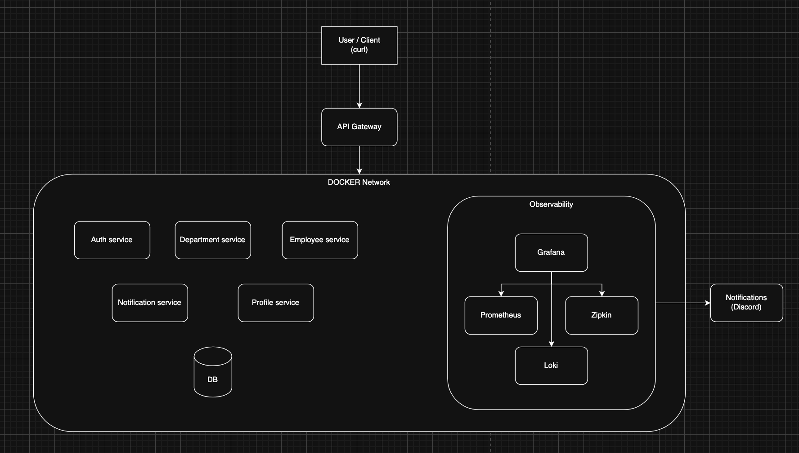
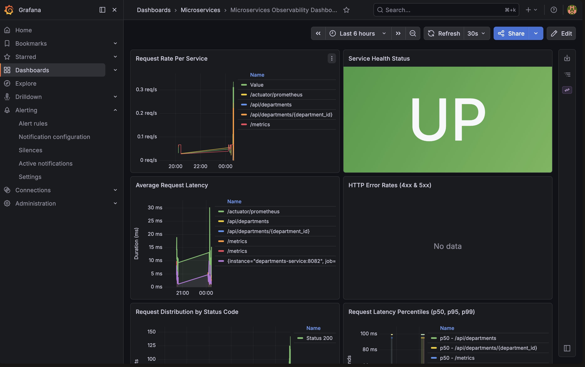
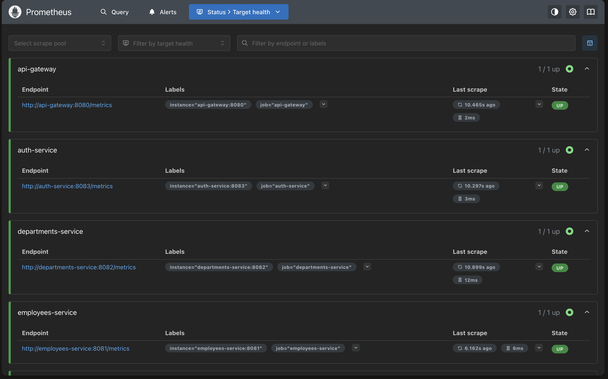
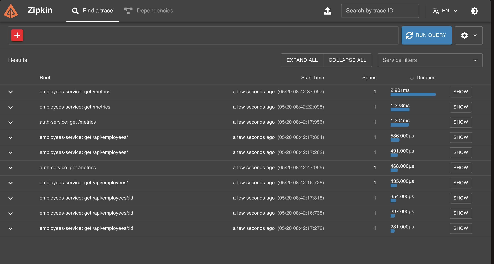
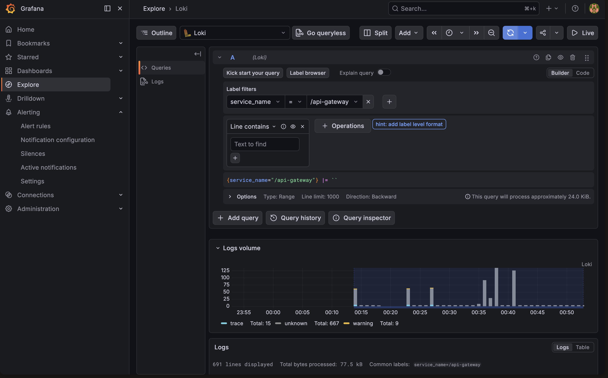
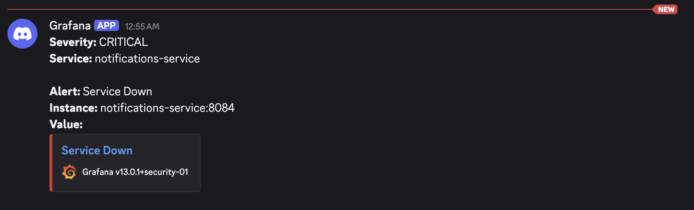
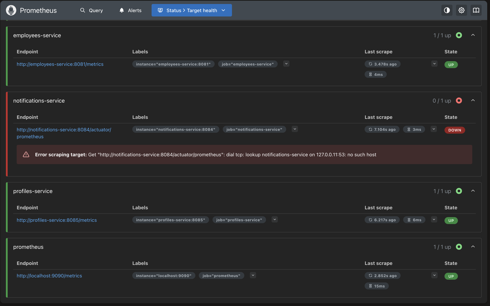

# Employee Onboarding & Offboarding System

A microservices-based system for managing employee onboarding and offboarding processes. This project contains four independent microservices that communicate via REST APIs and asynchronous messaging.

## Services Overview

### Employees Service (Go) - Port 8081

A Go-based service for managing employee records. Each employee is associated with a department.

### Departments Service (Python/FastAPI) - Port 8082

A FastAPI-based service for managing departments. Used by the employees service to validate department existence.

### Notifications Service (Java/Spring Boot) - Port 8084

A Spring Boot-based service that listens for employee events (creation/deletion) via RabbitMQ and persists a history of notifications sent to employees.

### Profile Management Service (TypeScript/Express) - Port 8085

A TypeScript-based service that combines asynchronous and synchronous communication. It consumes `employee.created` events to automatically create profiles and exposes REST endpoints for querying and updating them.

## Architecture

The system consists of the following components:

- **Employees Service (Go)** - Manages employee data on port 8081
- **Departments Service (Python/FastAPI)** - Manages department data on port 8082
- **Notifications Service (Java/Spring Boot)** - Manages notification history on port 8084
- **Profile Management Service (TypeScript)** - Manages user profiles on port 8085
- **RabbitMQ** - Message broker for event-driven communication
- **PostgreSQL databases** (one for each service)
- **Docker Compose** for orchestration

## Prerequisites

- Docker and Docker Compose
- Go 1.24+ (for local development of employees service)
- Python 3.11+ (for local development of departments service)
- Java 17+ (for local development of notifications service)
- Node.js 20+ & TypeScript (for local development of profiles service)
- PostgreSQL 15+ (for local development)

## Quick Start with Docker Compose

Clone the repository:

```bash
git clone https://github.com/Josedzzz/microservices-fp.git
cd microservices-fp
```

### Start all services

```bash
docker-compose up --build
```

This command will build the microservices, create the PostgreSQL databases, set up a network for service communication, and start all containers.

Verify the services running:

```bash
docker ps
```

You should see **twelve** containers running:

- **api-gateway**: Central entry point (Port 8000)
- **auth-service**: Identity provider
- **employees-service**: Core employee logic
- **departments-service**: Department management
- **notifications-service**: Event-driven notifications
- **profiles-service**: User profiles
- **rabbitmq**: Message broker
- **database-auth**: Auth data
- **database-employees**: Employee data
- **database-departments**: Department data
- **database-notifications**: Notification data
- **database-profiles**: Profile data

## Services API documentation

All documentation is accessible both directly (for development) and through the API Gateway:

### Directly (Localhost)

- **Auth Service**: http://localhost:8083/swagger/index.html
- **Employees Service**: http://localhost:8081/swagger/index.html
- **Departments Service**: http://localhost:8082/docs
- **Notifications Service**: http://localhost:8084/swagger-ui/index.html
- **Profiles Service**: http://localhost:8085/swagger

### Through API Gateway (Port 8000)

- **Employees Docs**: http://localhost:8000/employees-service/swagger/index.html
- **Departments Docs**: http://localhost:8000/departments-service/docs
- **Notifications Docs**: http://localhost:8000/notifications-service/swagger-ui/index.html
- **Profiles Docs**: http://localhost:8000/profiles-service/swagger

---

## Health Endpoints

All microservices expose a standardized `/health` endpoint for monitoring and orchestration. These endpoints perform dependency checks (database, message broker) and return HTTP 200 (UP) or HTTP 503 (DOWN/degraded).

### Health Endpoint Details

| Service | Port | Endpoint | Dependencies Checked |
|---------|------|----------|---------------------|
| **API Gateway** | 8080 | `GET /health` | None (liveness-only) |
| **Auth Service** | 8083 | `GET /health` | PostgreSQL, RabbitMQ |
| **Employees Service** | 8081 | `GET /health` | PostgreSQL, RabbitMQ |
| **Departments Service** | 8082 | `GET /health` | PostgreSQL |
| **Notifications Service** | 8084 | `GET /health` | PostgreSQL, RabbitMQ |
| **Profiles Service** | 8085 | `GET /health` | PostgreSQL, RabbitMQ |

### Health Response Format

All health endpoints return a standardized JSON response:

```json
{
  "status": "UP",
  "service": "service-name",
  "checks": {
    "database": "UP",
    "messageBroker": "UP"
  }
}
```

**Status Values:**
- `UP`: Service and all dependencies are healthy (HTTP 200)
- `DOWN`: Service or critical dependency is unavailable (HTTP 503)

**Check Values:**
- `UP`: Dependency is available and responding
- `DOWN`: Dependency is unavailable
- `UNKNOWN`: Dependency check was not performed (graceful fallback; still returns HTTP 200)

### Example: Health Check via cURL

```bash
# Check employees service health
curl -i http://localhost:8081/health

# Expected response (HTTP 200 if healthy):
{
  "status": "UP",
  "service": "employee-management",
  "checks": {
    "database": "UP",
    "messageBroker": "UP"
  }
}

# Expected response (HTTP 503 if unhealthy):
{
  "status": "DOWN",
  "service": "employee-management",
  "checks": {
    "database": "DOWN",
    "messageBroker": "UP"
  }
}
```

### Docker Healthchecks

Each microservice container includes a Docker healthcheck probe (`docker-compose.yml`) that:
- Polls `/health` every 10 seconds
- Allows 5 seconds for a response (timeout)
- Retries up to 5 times before marking the container unhealthy
- Uses `wget` to verify HTTP 200/503 status

---

## Token Instructions & Usage Examples

### 1. Login (Public)

The Gateway proxies the `/auth-service` directly.

```bash
curl -X POST http://localhost:8000/auth-service/api/login \
  -H "Content-Type: application/json" \
  -d '{
    "email": "admin@onboarding.com",
    "password": "admin123"
  }'
```

_Expected Response: JSON with `access_token`._

### 2. Protected Endpoint (Read-only for USER, Total for ADMIN)

```bash
# Get all employees
curl -X GET http://localhost:8000/employees-service/api/employees \
  -H "Authorization: Bearer <YOUR_JWT_TOKEN>"
```

### 3. Admin-Only Endpoint (Write operations)

```bash
# Create a new department (Requires ADMIN role in JWT)
curl -X POST http://localhost:8000/departments-service/api/departments \
  -H "Authorization: Bearer <ADMIN_JWT_TOKEN>" \
  -H "Content-Type: application/json" \
  -d '{
    "name": "Engineering",
    "description": "Technical team"
  }'
```

_Note: If a USER attempts this, the Gateway will return `403 Forbidden`._

### 4. Password Recovery (Public)

```bash
curl -X POST http://localhost:8000/auth-service/api/recover-password \
  -H "Content-Type: application/json" \
  -d '{"email": "juan@empresa.com"}'
```

---

#### Security Flow:

1. **Bootstrap Admin:** A seed admin is created automatically (`admin@onboarding.com` / `admin123`).
2. **Gateway Entrance:** All traffic enters through `http://localhost:8000`. The Gateway validates the JWT signature and checks the expiration.
3. **Onboarding:** Create an employee via `POST http://localhost:8000/employees-service/api/employees`.
4. **Activation:** Use the token from the logs to set a password via `POST http://localhost:8000/auth-service/api/reset-password`.
5. **RBAC:** The Gateway enforces: `ADMIN` role required for POST/PUT/DELETE. `USER` role has read-only (GET) access.

---

## Structured Logging & Centralized Log Aggregation

### Overview

All microservices emit **structured JSON logs** compatible with **Loki** log aggregation. This enables:
- **Centralized log collection** via Promtail
- **Full-text search** in Grafana
- **Trace correlation** with OpenTelemetry (traceId in every log)
- **Easy debugging** across microservices
- **No local file storage** required (Docker stdout only)

### Why Structured Logging?

1. **Consistency**: All logs follow the same JSON schema across all languages/frameworks
2. **Searchability**: Loki indexes logs by labels (service, level, traceId) for fast queries
3. **Trace Correlation**: Every log includes `traceId` from OpenTelemetry span context
4. **Machine-Readable**: JSON format enables programmatic parsing and alerting
5. **Production-Ready**: Lightweight, no extra disk I/O, stdout-based logging

### Logging Stack Architecture

```
[Microservices] --stdout--> [Docker Container] --socket--> [Promtail]
                                                               |
                                                               v
                                                          [Loki (3100)]
                                                               |
                                                               v
                                                        [Grafana (3000)]
```

### Log Format (JSON Schema)

All services output logs in this format:

```json
{
  "timestamp": "2026-05-18T15:30:45.123Z",
  "level": "INFO",
  "service": "employee-management",
  "traceId": "a1b2c3d4e5f6g7h8i9j0k1l2m3n4o5p6",
  "message": "Employee created successfully",
  "caller": "handlers/employee.go:123"
}
```

**Key Fields:**
- `timestamp`: ISO 8601 format (UTC)
- `level`: DEBUG, INFO, WARN, ERROR
- `service`: Service name (e.g., "employee-management")
- `traceId`: OpenTelemetry trace ID (empty if no active span)
- `message`: Human-readable log message
- `caller`: Source code location (file:line)

### Logging Implementation per Service

#### Go Services (api-gateway, auth-service, employee-management)

**Logger**: `go.uber.org/zap` with JSON encoder

**Usage**:
```go
import "employee-management/logging"

ctx := context.Background()

// Initialize logger once at startup
if err := logging.Initialize("employee-management"); err != nil {
    panic(err)
}
defer logging.Sync()

// Log with context (automatically extracts traceId)
logging.Info(ctx, "Employee created successfully", zap.String("employee_id", "123"))
logging.Error(ctx, "Failed to save employee", err, zap.String("email", "test@example.com"))
```

**Example Output**:
```json
{"timestamp":"2026-05-18T15:30:45.123Z","level":"INFO","service":"employee-management","traceId":"a1b2c3d4e5f6g7h8i9j0k1l2m3n4o5p6","message":"Employee created successfully","employee_id":"123","caller":"handlers/employee_handler.go:45"}
```

#### Python/FastAPI (department-management)

**Logger**: `python-json-logger` with structured logging

**Usage**:
```python
from app.logging_config import initialize as init_logger

logger = init_logger("department-management")

logger.info("Department created successfully", extra={"department_id": "456"})
logger.error(f"Database error: {str(e)}", extra={"error": str(e)})
```

**Example Output**:
```json
{"timestamp":"2026-05-18T15:30:45.123Z","level":"INFO","service":"department-management","traceId":"","message":"Department created successfully","department_id":"456"}
```

#### Java/Spring Boot (notification-service)

**Logger**: `SLF4J` + `Logstash Logback Encoder` (JSON output)

**Configuration**: `logback-spring.xml` auto-configures JSON encoder

**Usage**:
```java
import org.slf4j.Logger;
import org.slf4j.LoggerFactory;

Logger logger = LoggerFactory.getLogger(NotificationController.class);

logger.info("Notification sent successfully");
logger.error("Failed to send notification", exception);
```

**Example Output**:
```json
{"@timestamp":"2026-05-18T15:30:45.123Z","@version":"1","level":"INFO","service":"notification-service","message":"Notification sent successfully","caller":"com.microservices.notification.controller.NotificationController"}
```

#### Node.js/Express (profile-management)

**Logger**: `pino` with HTTP middleware

**Usage**:
```typescript
import { getLogger } from "./logging";

const logger = getLogger();

logger.info("Profile created successfully");
logger.error({ err }, "Failed to create profile");
```

**Example Output**:
```json
{"level":"INFO","time":"2026-05-18T15:30:45.123Z","service":"profile-management","traceId":"a1b2c3d4e5f6g7h8i9j0k1l2m3n4o5p6","message":"Profile created successfully"}
```

### Trace ID Correlation

**Automatic Injection**: Every log automatically includes the `traceId` from the current OpenTelemetry span context. This enables correlation between:
- **Distributed Traces** (in Zipkin) → `trace_id`
- **Structured Logs** (in Loki) → `traceId` field

**Example Flow**:
1. Client sends request to API Gateway
2. Gateway generates OpenTelemetry span (with trace_id = `abc123`)
3. Request flows through services: Gateway → Auth → Employees → Employee-Management
4. Each service logs with the **same trace_id = `abc123`**
5. In Grafana/Loki: Search `traceId=abc123` to see **all logs** for that request across **all services**

### Accessing Logs in Grafana

#### Connect Loki to Grafana

1. Open Grafana: http://localhost:3000 (admin/admin)
2. Go to **Configuration** → **Data Sources**
3. Click **Add data source**
4. Select **Loki**
5. URL: `http://loki:3100`
6. Click **Save & Test**

#### Example Queries

**Search by Service**:
```
{service="employee-management"}
```

**Search by Level**:
```
{level="ERROR"} | json
```

**Search by Trace ID**:
```
{traceId="a1b2c3d4e5f6g7h8i9j0k1l2m3n4o5p6"}
```

**Combine Filters**:
```
{service="auth-service", level="WARN"} | json
```

**Count Errors in Last Hour**:
```
count_over_time({service="notification-service", level="ERROR"}[1h])
```

### Promtail Configuration

Promtail collects logs from Docker containers via:

1. **Docker Socket**: `/var/run/docker.sock`
2. **JSON Parsing**: Automatically parses JSON logs
3. **Label Extraction**: Extracts `service`, `level`, `traceId` from JSON
4. **Push to Loki**: Sends formatted logs to http://loki:3100

Configuration file: `observability/promtail/promtail-config.yml`

### Docker Integration

- **No Changes Required**: Logs automatically go to `stdout`
- **Docker Desktop**: Logs appear in `docker logs <container>`
- **Promtail**: Automatically discovers containers via Docker API
- **No Disk Space**: All logs streamed to Loki (no local files)

### Performance Considerations

- **Async Logging**: Java service uses `AsyncAppender` for non-blocking I/O
- **Batching**: Promtail batches logs before sending to Loki
- **Compression**: Loki compresses logs for storage efficiency
- **Sampling**: Can configure log sampling for high-volume services (if needed)

### Best Practices

1. **Always Include Context**: Use `extra` / `fields` to add business context
   ```go
   logging.Info(ctx, "User login", zap.String("user_id", userID), zap.String("ip", clientIP))
   ```

2. **Log Errors Completely**: Include both message and error object
   ```go
   logging.Error(ctx, "Database query failed", err)
   ```

3. **Use Appropriate Levels**:
   - `DEBUG`: Development-only, verbose details
   - `INFO`: Important business events (login, payment, creation)
   - `WARN`: Unexpected but recoverable (retry, fallback)
   - `ERROR`: Failures that need investigation

4. **Never Log Secrets**: Passwords, API keys, tokens (use <redacted>)

---

## Continuous Integration & Deployment

### Conceptual Overview

**Continuous Integration (CI)** is a development practice where code changes are automatically tested and verified as soon as they are committed to the repository. This system integrates **Jenkins** as the CI orchestrator, **SonarQube** for static code analysis and coverage reporting, and **Docker** for containerized builds and multi-service end-to-end testing.

#### Why CI in this Architecture?

This microservices project benefits from CI because:

1. **Automated Verification**: Each commit triggers automated build, unit, and integration tests, catching regressions early.
2. **Code Quality Consistency**: SonarQube enforces minimum coverage thresholds (≥70%) and identifies code smells, security vulnerabilities, and duplications.
3. **Fast Feedback Loops**: Developers receive pipeline results (pass/fail) within minutes, enabling quick iteration.
4. **Reliable Releases**: Multi-language pipelines (Go, Java) ensure language-specific quality gates are met before packaging.
5. **Container Readiness**: Successful builds are automatically packaged as Docker images, ready for deployment.
6. **Multi-Service Validation**: E2E tests verify that all services work together before merging.

---

### Jenkins Access Guide

#### Access URL

```
http://localhost:9090
```

When Jenkins is running via `docker-compose up`, it is accessible on port 9090.

#### Default Admin Credentials

```
Username: admin
Password: (Retrieved from logs during first startup)
```

#### Retrieving the Initial Admin Password

**Option 1: From Container Logs (Recommended)**

```bash
docker logs microservices-fp_jenkins_1 2>&1 | grep -A 5 "initialAdminPassword"
```

Look for output similar to:

```
*************************************************************
*************************************************************
*************************************************************

Jenkins initial setup is required. An admin user has been created and a password generated.
Please use the following password to proceed to installation:

<YOUR_INITIAL_ADMIN_PASSWORD>

This may also be found at: /var/jenkins_home/secrets/initialAdminPassword

*************************************************************
*************************************************************
*************************************************************
```

**Option 2: From Docker Volume**

```bash
docker exec microservices-fp_jenkins_1 cat /var/jenkins_home/secrets/initialAdminPassword
```

**Option 3: From Host Mount**

If you have direct access to the Jenkins volume:

```bash
cat /path/to/jenkins_home/secrets/initialAdminPassword
```

#### Initial Setup Steps

1. Navigate to `http://localhost:9090` in your browser.
2. Enter the initial admin password (from above).
3. Click **"Install suggested plugins"** to install the pre-configured plugin set.
4. Create your first admin user (or skip to use the temporary admin account).
5. Confirm Jenkins URL: `http://localhost:9090` (or adjust for your environment).
6. Click **"Start using Jenkins"**.

After initialization, the Jenkins Configuration as Code (JCasC) configuration will automatically:

- Configure the SonarQube server connection.
- Create pipeline jobs for `notification-service` and `auth-service`.
- Set up credentials for SonarQube token and registry access.

---

### Setup Instructions

#### 1. Start the Entire System (Including Jenkins & SonarQube)

```bash
cd /path/to/microservices-fp

docker-compose up --build
```

This command orchestrates:

- **Jenkins** (port 9090) with Docker-outside-of-Docker (DooD) via socket mount
- **SonarQube** (port 9000) with PostgreSQL backend
- **Docker Registry** (port 5000) for pushing built images
- All microservices and their databases
- **RabbitMQ** for event-driven communication

Wait for all containers to be healthy (typically 1-2 minutes).

#### 2. Access Jenkins and Configure Credentials

1. Open `http://localhost:9090` and complete the initial setup (see **Jenkins Access Guide** above).

2. Create a **SonarQube Token** credential:

   - Go to **Manage Jenkins** → **Manage Credentials** → **System** → **Global credentials (unrestricted)**.
   - Click **Add Credentials**.
   - **Kind**: Secret text
   - **Secret**: Retrieve from SonarQube:
     ```bash
     # Open http://localhost:9000 (default user: admin / password: admin)
     # User → My Account → Security → Generate token
     ```
   - **ID**: `sonar-token`
   - Click **Create**.

3. Verify **SonarQube Server Connection**:
   - Go to **Manage Jenkins** → **System Configuration** → Find section "SonarQube servers".
   - Ensure URL is `http://sonarqube:9000` and token is set.
   - Click **Test Connection** (should show success).

#### 3. Verify Pipelines Are Auto-Provisioned

Navigate to Jenkins dashboard. You should see two pipeline jobs:

- **notification-service-pipeline** (Java/Maven)
- **auth-service-pipeline** (Go)

These are auto-created by JCasC (`jenkins/casc.yaml`). If they don't appear:

```bash
# Restart Jenkins to reload JCasC config
docker restart microservices-fp_jenkins_1
```

#### 4. Trigger a Pipeline Manually

**Option 1: Via Jenkins UI**

1. Click on the pipeline job (e.g., `notification-service-pipeline`).
2. Click **Build Now** (top-left).
3. Jenkins clones the repo, checks out the specified branch, and runs the Jenkinsfile.

**Option 2: Via Git Webhook (Optional)**

Configure GitHub to send push events to Jenkins:

```
Jenkins → Manage Jenkins → System Configuration → GitHub Server
Repo URL: https://github.com/Josedzzz/microservices-fp
Webhook: http://<your-jenkins-ip>:9090/github-webhook/
```

Then any push to the repo triggers the pipeline automatically.

**Option 3: Via curl**

```bash
curl -X POST http://localhost:9090/job/notification-service-pipeline/build \
  -u admin:<password>
```

---

### Pipeline Stage Breakdown

Both pipelines (notification-service and auth-service) follow a **Declarative Pipeline** pattern with stages that ensure build quality, coverage, and readiness for deployment.

#### Stage 1: **Checkout**

- **Purpose**: Fetch the latest code from the repository.
- **What it verifies**:
  - Git repository is accessible.
  - Specified branch/commit is available.
  - Jenkinsfile is present in the service directory.
- **Failure reason**: Repository not reachable, branch doesn't exist, or network issue.

#### Stage 2: **Build**

**For notification-service (Java/Maven):**

- Runs `mvn clean compile` inside a Maven 3.9 + OpenJDK 17 Docker container.
- Compiles Java sources and resolves Maven dependencies.
- Output: Compiled `.class` files and assembled JAR dependencies.

**For auth-service (Go):**

- Runs `go build` inside a Go 1.25 Docker container.
- Downloads Go modules and compiles the binary.
- Output: `auth-server` executable in the service directory.
- **Caching**: Go module cache and build cache are stored locally in the workspace to speed up subsequent builds.

#### Stage 3: **Test**

**For notification-service:**

- Runs `mvn verify` (includes `mvn test`).
- Executes all JUnit tests and generates coverage via **JaCoCo** plugin.
- Output: JUnit XML reports in `target/surefire-reports/` and coverage in `target/site/jacoco/`.

**For auth-service:**

- Runs `go test ./... -coverprofile=coverage.out`.
- Executes all `*_test.go` files and generates Go coverage profile.
- Output: Coverage report in `.scannerwork/coverage.out`.
- **Failure reason**: Test failures, assertion errors, or uncaught panics.

#### Stage 4: **SonarQube Analysis**

- Runs `sonar-scanner` (or Maven sonar plugin) to analyze code quality.
- Submits coverage reports, duplication metrics, and security findings to SonarQube.
- Communicates with SonarQube server (`http://sonarqube:9000`) to create a new analysis.
- Output: SonarQube dashboard updated; `report-task.txt` generated with task URL.
- **Failure reason**: Sonar server unreachable, invalid token, or configuration error.

#### Stage 5: **Quality Gate**

- **Purpose**: Enforce quality standards before allowing the build to proceed.
- **What it checks**:
  - Code coverage is above minimum threshold (configured per project).
  - No critical or blocker-level issues detected.
  - Security vulnerabilities meet acceptance criteria.
- **How it works**:
  - Polls the Sonar CE task endpoint to check analysis completion.
  - Retrieves quality gate status from SonarQube API.
  - **Pass**: Status is `OK` → proceed to next stage.
  - **Fail**: Status is `ERROR` → pipeline stops; no deployment occurs.
- **Output**: Console log shows "Quality Gate status: OK" or failure details.
- **Failure reason**: Coverage too low, critical issues present, or gate configuration not met.

#### Stage 6: **Package**

- **Purpose**: Build a Docker image and push to the local registry.
- **Steps**:
  1. Reads the service's `Dockerfile` (multi-stage: build → runtime).
  2. Runs `docker build -t localhost:5000/<service>:<BUILD_NUMBER> .`.
  3. Tags the image with `latest` tag as well.
  4. Pushes both tags to the local Docker registry (`http://localhost:5000`).
- **Output**: Image available in registry; can be deployed to other environments.
- **Failure reason**: Docker daemon unreachable, build layer fails, or registry unavailable.

#### Stage 7: **E2E Tests** _(notification-service only, can be extended)_

- **Purpose**: Verify the microservice works correctly in a full-stack environment.
- **Steps**:
  1. Cleans up any orphaned service containers from previous runs.
  2. Runs `docker-compose up` with the newly built image to start:
     - The microservice (using the built image from registry)
     - Its PostgreSQL database
     - Dependent services (RabbitMQ, other services)
  3. Executes end-to-end tests (e.g., API health checks, event consumption).
  4. Collects logs and outputs for debugging.
- **Output**: Service logs and test results; confirms service is production-ready.
- **Failure reason**: Service failed to start, database migration error, E2E test assertion failed, or inter-service communication broken.

#### Stage 8: **Post Actions**

- **Purpose**: Archive build artifacts and logs for future reference.
- **Actions**:
  - Archive coverage reports, test results, and SonarQube task report.
  - Collect logs from service containers for debugging failures.
- **Output**: Artifacts accessible in the Jenkins job's "Archive" tab.

---

### Interpreting Results

#### Jenkins Dashboard View

After a pipeline run completes, Jenkins displays the stage view:


**Stage Status Indicators:**

| Status         | Color     | Meaning                                                        |
| -------------- | --------- | -------------------------------------------------------------- |
| ✅ SUCCESS     | **Green** | Stage completed without errors.                                |
| ❌ FAILURE     | **Red**   | Stage failed; pipeline stopped. Subsequent stages are skipped. |
| ⊘ SKIPPED      | **Gray**  | Stage was not executed (usually due to earlier failure).       |
| ⏳ IN PROGRESS | **Blue**  | Stage is currently running.                                    |

#### Interpreting Common Failures

**Red stage: "Build"**

- **Cause**: Compilation error (syntax, missing imports, or incompatible dependency).
- **Fix**: Check console output for compiler errors; correct code and push fix.

**Red stage: "Test"**

- **Cause**: Unit test failed (assertion, NPE, timeout).
- **Fix**: Review test logs; debug failing test and push fix.

**Red stage: "Quality Gate"**

- **Cause**: Coverage below threshold or critical issues detected.
- **Fix**: Increase test coverage or resolve Sonar issues; see SonarQube dashboard for details.

**Red stage: "Package"**

- **Cause**: Docker build failed (missing file, layer failure).
- **Fix**: Verify Dockerfile syntax and dependencies; check Docker daemon logs.

**Red stage: "E2E Tests"**

- **Cause**: Service failed to start, test assertion failed, or inter-service communication broken.
- **Fix**: Review service startup logs; check database migrations and network connectivity.

#### Viewing Console Output

1. Click on the failed pipeline job in Jenkins.
2. Click **Console Output** (or stage-specific logs).
3. Scroll to the error; identify the root cause.
4. Example error output:
   ```
   FAILURE: Post-Conditions Check Failed
   Quality Gate has failed. See SonarQube for details.
   ```

#### Checking SonarQube Dashboard

For code quality issues:

1. Open `http://localhost:9000` (Admin credentials: `admin` / `admin`).
2. Navigate to project (e.g., `notification-service`).
3. Review:
   - **Code Smells**: Maintainability issues.
   - **Security Hotspots**: Potential vulnerabilities.
   - **Coverage**: Current test coverage percentage.
   - **Duplications**: Repeated code blocks.

---

### Architecture: Docker-outside-of-Docker (DooD)

Jenkins runs inside a container but needs to build and run other containers (for tests, E2E, packaging). This is achieved via **Docker-outside-of-Docker (DooD)**:

- Jenkins container mounts the host's Docker socket: `/var/run/docker.sock:/var/run/docker.sock`.
- Jenkins runs Docker commands directly on the host daemon (not a nested Docker instance).
- Agents use `docker` CLI and `docker compose` to orchestrate services.

**Benefit**: No performance overhead; fully isolated build environments per job.

---

### Environment Variables & Configuration

#### Jenkins Environment Variables

| Variable              | Value                                    | Purpose                         |
| --------------------- | ---------------------------------------- | ------------------------------- |
| `JAVA_OPTS`           | `-Djenkins.install.runSetupWizard=false` | Skip setup wizard on first run. |
| `CASC_JENKINS_CONFIG` | `/var/jenkins_home/casc_configs`         | JCasC config directory.         |

#### SonarQube Configuration

- **Server URL**: `http://sonarqube:9000`
- **Default Credentials**: `admin` / `admin` (changeable via UI)
- **Token**: Generated per user; required for CI integration.

#### Docker Registry

- **Local Registry URL**: `localhost:5000`
- **Images pushed**: `localhost:5000/notification-service:<BUILD_NUMBER>`
- **Cleanup**: Manual `docker image rm` or registry garbage collection.

---

## Technical Challenge Documentation (Reto 6)

### Punto 1: Jenkins Configuration - Technical Q&A

#### Q: What additional plugins are pre-installed in the Dockerfile based on tools used in later points?

**A:** The Jenkins Dockerfile pre-installs seven key plugins via `jenkins-plugin-cli`:

1. **workflow-aggregator**: Enables declarative and scripted pipeline support
2. **git**: Git integration for repository checkout
3. **docker-pipeline**: Docker integration within Jenkinsfile (for `docker.image()` commands)
4. **pipeline-stage-view**: Visual stage representation in Jenkins UI
5. **configuration-as-code (JCasC)**: Auto-configuration from `jenkins/casc.yaml`
6. **job-dsl**: Programmatic job creation (required by JCasC for pipeline jobs)
7. **sonar**: SonarQube scanner integration for quality analysis

These plugins enable the complete CI/CD workflow: containerized builds, static analysis, and automated job provisioning.

#### Q: Does it mount the Docker socket or use DinD? How does it resolve Docker socket permissions?

**A:** The implementation uses **Docker-outside-of-Docker (DooD)** with socket mounting:

- **Socket Mounting**: `/var/run/docker.sock:/var/run/docker.sock` is mounted in docker-compose.yml
- **Permission Resolution**:
  1. Jenkins Dockerfile installs `docker.io` as root user
  2. Adds the `jenkins` user to the Docker group: `usermod -aG docker jenkins`
  3. The group ID is mapped in docker-compose: `group_add: ["991"]` (Docker daemon's group ID on host)
  4. This allows jenkins user to access the socket without needing `sudo`

**Advantage over DinD**: Simpler setup, better performance (no Docker-in-Docker overhead), and direct host Docker daemon access for image building and container management.

#### Q: Does it disable the Setup Wizard or keep it for manual admin user creation?

**A:** The Setup Wizard is **disabled** via the environment variable:

```yaml
environment:
  - JAVA_OPTS=-Djenkins.install.runSetupWizard=false
```

This means:

- Jenkins skips the interactive setup wizard on first run
- Admin user credentials must be retrieved from `/var/jenkins_home/secrets/initialAdminPassword`
- Jenkins Configuration as Code (JCasC) automatically configures everything (no manual UI setup needed)
- This is ideal for CI/CD environments where automation and reproducibility are critical

---

### Punto 2: Build & Test Jenkinsfiles - Technical Q&A

#### Q: How does dependency management avoid downloading all dependencies from scratch on each run?

**A:** The pipeline uses **Docker volume mounting** for dependency caches:

**For Maven (notification-service)**:

```groovy
docker.image('maven:3.9.6-eclipse-temurin-17')
  .inside("-v /var/jenkins_home/.m2:/root/.m2 --network ${DOCKER_NET}") {
    // Maven caches to /root/.m2 which maps to Jenkins volume
  }
```

In docker-compose.yml:

```yaml
volumes:
  - maven_cache:/var/jenkins_home/.m2
```

**For Go (auth-service)**:

```bash
export GOMODCACHE="$WORKSPACE/.go/pkg/mod"
export GOCACHE="$WORKSPACE/.go/cache"
mkdir -p "$GOMODCACHE" "$GOCACHE"
go mod download  # Downloads to the cached location
```

**Benefits**:

- Maven dependencies (~400MB) are downloaded once and reused across builds
- Go modules and build cache avoid repeated downloads
- Builds complete 2-3x faster after the initial run
- Reduces bandwidth and network latency

---

### Punto 3: SonarQube Integration - Technical Q&A

#### Q: How does the pipeline manage the SonarQube token?

**A:** The SonarQube token is managed using **Jenkins Credentials**:

1. **Storage**: Token is stored in Jenkins Credentials as `sonar-token` (type: `Secret text`)

   - Retrieved in Jenkinsfile: `withCredentials([string(credentialsId: 'sonar-token', variable: 'SONAR_TOKEN')])`
   - Not stored in docker-compose.yml or git repositories (no hardcoding)

2. **Token Generation**:

   - Created in SonarQube dashboard: `http://localhost:9000 > Account > Security > Tokens`
   - Must be configured manually after SonarQube first startup

3. **Usage in Pipeline**:
   - Auth-service: `sonar-scanner -Dsonar.login="$SONAR_TOKEN"`
   - Notification-service: `mvn sonar:sonar -Dsonar.login="$SONAR_TOKEN"`

This approach keeps credentials secure and separate from infrastructure configuration.

#### Q: Does it use the default Quality Gate ("Sonar way") or a custom one? What are the thresholds?

**A:** The implementation uses **SonarQube's default "Sonar way" Quality Gate** with these thresholds:

- **Code Coverage**: ≥ 70% (enforced via `sonar-project.properties`)
- **Code Duplication**: < 3%
- **Code Smells**: Blockers and Critical issues must be 0
- **Security Hotspots**: Must be reviewed
- **Reliability**: No critical or blocker issues

To verify the gate:

1. Navigate to `http://localhost:9000 > Quality Gates`
2. The "Sonar way" gate appears as default
3. Each project's "Quality Gate" setting is configured in `sonar-project.properties`

**Customization Option**: To create a custom gate:

- SonarQube UI > Quality Gates > Create
- Set thresholds per language (Go, Java, etc.)

#### Q: How does it configure the SonarQube webhook for quality gate checks? For non-Java languages, how is sonar-scanner installed?

**A:**

**Quality Gate Polling (instead of webhooks)**:

- The pipeline does NOT use webhooks; instead it **polls the CE task status** with exponential backoff:
  ```bash
  for i in $(seq 1 60); do
    CE_STATUS=$(curl -u "$SONAR_TOKEN:" "$CE_TASK_URL")
    if [ "$CE_STATUS" = "SUCCESS" ]; then break; fi
    sleep 5
  done
  ```
- This avoids webhook configuration complexity and works in isolated environments

**For non-Java languages (Go in auth-service)**:

The pipeline runs `sonar-scanner` inside a Docker container:

```groovy
docker.image('sonarsource/sonar-scanner-cli:latest')
  .inside("--network ${DOCKER_NET}") {
    sh 'sonar-scanner -Dsonar.projectKey=auth-service ...'
  }
```

- **Scanner Installation**: Pre-installed in `sonarsource/sonar-scanner-cli:latest` image
- **No setup required**: Docker handles the scanner availability
- **Go Coverage**: Configured in `sonar-project.properties`:
  ```properties
  sonar.go.coverage.reportPaths=coverage.out
  ```

For Java (notification-service), Maven plugin handles scanning:

```bash
mvn sonar:sonar -Dsonar.projectKey=notification-service
```

---

### Punto 4: Docker Packaging & E2E Testing - Technical Q&A

#### Q: What naming convention is used for Docker images? Does it include project prefix, semantic versioning, or commit hash?

**A:** The naming convention follows: `localhost:5000/<SERVICE_NAME>:<BUILD_NUMBER>` with additional tags:

```bash
docker build -t "localhost:5000/${SERVICE_NAME}:${BUILD_NUMBER}" \
             -t "localhost:5000/${SERVICE_NAME}:latest" \
             "${SERVICE_DIR}"
docker push "localhost:5000/${SERVICE_NAME}:${BUILD_NUMBER}"
docker push "localhost:5000/${SERVICE_NAME}:latest"
```

**Convention breakdown**:

- **Registry**: `localhost:5000` (local Docker registry)
- **Service Name**: `notification-service`, `auth-service` (environment variable: `${SERVICE_NAME}`)
- **Build Number Tag**: Jenkins build ID (ensures unique builds)
- **Latest Tag**: Always points to most recent build

**Example image names**:

- `localhost:5000/notification-service:42` (build #42)
- `localhost:5000/notification-service:latest` (current)

**Note**: This project does NOT use:

- Semantic versioning (v1.2.3) - managed by external release process
- Commit hashes - BUILD_NUMBER provides sufficient traceability
- Project prefix - single registry serves all services

#### Q: Do the Dockerfiles use multi-stage builds? How does this integrate with the pipeline?

**A:** **YES**, all microservices use multi-stage builds to optimize image sizes:

**Example 1: Java (notification-service)**

```dockerfile
FROM maven:3.9-eclipse-temurin-17 AS build
# Build stage: compile, test, package (~800MB intermediate)
COPY pom.xml ./
RUN mvn -B -DskipTests clean package

FROM eclipse-temurin:17-jre
# Runtime stage: ~300MB final image
COPY --from=build /app/target/notification-service-*.jar /app/app.jar
```

**Example 2: Go (auth-service, employee-management)**

```dockerfile
FROM golang:1.24-alpine AS builder
# Build stage: compile (~700MB intermediate)
RUN go build -o app-server ./cmd

FROM alpine:latest
# Runtime stage: ~50MB final image
COPY --from=builder /app/app-server .
```

**Example 3: Node.js (profile-management)**

```dockerfile
FROM node:20-alpine AS build
# Build stage: npm install, build (~500MB intermediate)
RUN npm run build

FROM node:20-alpine
# Runtime stage: ~200MB final image (prod dependencies only)
RUN npm install --omit=dev
```

**Pipeline Integration**:

- Docker build happens in "Package" stage of Jenkinsfile
- Multi-stage builds are automatic (no special Jenkinsfile configuration)
- Benefits: Smaller images (faster push/pull), reduced attack surface

#### Q: Is it a local or remote registry? How is authentication configured?

**A:** The implementation uses a **local Docker registry** running in docker-compose:

```yaml
registry:
  image: registry:2
  container_name: registry
  ports:
    - "5000:5000"
  volumes:
    - registry_data:/var/lib/registry
  networks:
    - microservices-network
```

**Registry Configuration**:

- **Location**: `localhost:5000` (accessible within docker-compose network as `registry:5000`)
- **Authentication**: NONE (unauthenticated registry for development)
- **Storage**: Persists to Docker volume `registry_data` (survives `docker-compose down`)

**Pipeline Integration**:

```bash
docker push "localhost:5000/${SERVICE_NAME}:${BUILD_NUMBER}"
```

**For Production**: Replace with Docker Hub or private registry:

- Docker Hub: Use `docker login` with credentials stored in Jenkins
- Private Registry (Nexus, Artifactory): Configure authentication in Jenkins credentials

#### Q: How does the pipeline verify all services are ready before running E2E tests?

**A:** The E2E stage performs **multi-level health checks**:

**1. Service Startup** (docker-compose up):

```bash
run_compose --project-name "${CI_PROJECT}" --profile test up -d --build \
  rabbitmq \
  database-employees employees-service \
  database-departments departments-service \
  database-notifications notifications-service \
  database-profiles profiles-service \
  database-auth auth-service \
  api-gateway
```

**2. HTTP Polling** (explicit checks before BDD tests):

```bash
wait_for_http "API Gateway" "http://api-gateway:8080/" 60
wait_for_http "Auth Service" "http://auth-service:8083/api/swagger.yaml" 60
wait_for_http "Employees Service" "http://employees-service:8081/api/health" 60
wait_for_http "Departments Service" "http://departments-service:8082/api/" 60
wait_for_http "Notifications Service" "http://notifications-service:8084/v3/api-docs" 60
wait_for_http "Profiles Service" "http://profiles-service:8085/health" 60
```

Where `wait_for_http` is a polling function:

```bash
for i in $(seq 1 "${max_tries}"); do
  if docker run --rm --network "${NET}" curlimages/curl:8.10.1 \
     -fsS "${url}" >/dev/null 2>&1; then
    echo "${name} is ready"
    return 0
  fi
  sleep 5
done
```

**3. Why this approach**:

- `depends_on` with `condition: service_started` only checks container startup, not readiness
- HTTP polling ensures services are actually accepting connections
- 60 retries × 5 seconds = 5 minutes max wait time
- Prevents flaky tests by waiting for services to be truly ready

#### Q: How does the pipeline guarantee E2E tests don't interfere with data from previous runs?

**A:** Complete isolation is achieved through **project-specific containers and data cleanup**:

**1. Unique Project Naming** (per build):

```bash
CI_PROJECT="ci-${BUILD_NUMBER}"
run_compose --project-name "${CI_PROJECT}" ...
```

Results in:

- Network: `ci-42_onboarding-network` (for build #42)
- Containers: `ci-42_database-notifications_1`, `ci-42_auth-service_1`, etc.
- Volumes: All test-specific, separate from production/previous runs

**2. Container Cleanup Before Tests**:

```bash
for container in rabbitmq database-employees database-departments \
                 database-notifications database-profiles database-auth \
                 api-gateway notifications-service employees-service \
                 departments-service profiles-service auth-service; do
  docker rm -f "$container" 2>/dev/null || true
done
docker container prune -f --filter "label!=keep=true" >/dev/null 2>&1 || true
```

**3. Volume Cleanup After Tests** (post section):

```bash
run_compose --project-name "${CI_PROJECT}" down -v --remove-orphans
```

The `down -v` flag removes:

- All containers created by the compose file
- Named volumes specific to that project
- Network specific to that project

**Result**: Each E2E test run is completely isolated; no data bleeds between builds.

---

### Punto 5: General CI/CD Architecture & Benefits

#### Q: Why should each microservice have its own Jenkinsfile instead of a monolithic Jenkins job?

**A:** Individual Jenkinsfiles per service provide:

1. **Decoupled Pipelines**: Each service's build is independent; failures in one don't block others
2. **Language-Specific Stages**: Go services use different build tools than Java or Node.js
3. **Scalability**: New services can be added without modifying central job definitions
4. **Debugging**: Service-specific logs make it easy to identify which service failed
5. **Parallel Execution**: Jenkins can trigger multiple service pipelines simultaneously

#### Q: What is the purpose of using Docker agents in the pipeline instead of bare Jenkins executors?

**A:** Docker agents provide:

1. **Clean Environment**: Each build starts fresh; no leftover artifacts from previous builds
2. **Language Isolation**: Go build environment doesn't interfere with Java or Node.js builds
3. **Reproducibility**: Builds are identical regardless of Jenkins host setup
4. **Security**: Services don't have direct host access; only what's mounted explicitly
5. **Scalability**: Can spin up arbitrary build images without installing them on Jenkins

#### Q: How does the pipeline ensure code quality before allowing deployments?

**A:** Multi-layered quality gates prevent poor code from reaching production:

1. **Unit Tests**: Each service's test stage runs unit tests and generates coverage reports
2. **SonarQube Analysis**: Static code analysis identifies bugs, security vulnerabilities, and code smells
3. **Quality Gate**: Enforces minimum coverage (≥70%), blocks if issues exceed thresholds
4. **E2E Tests**: Full system integration tests verify all services work together
5. **Build Artifact Archiving**: Test results are preserved for audit and troubleshooting

Failure at any stage stops the pipeline and prevents image push to registry.

#### Q: What is the CI/CD workflow from commit to production-ready Docker image?

**A:** The complete workflow is:

```
1. Developer commits code to GitHub
   ↓
2. GitHub webhook triggers Jenkins pipeline (if configured)
   ↓
3. Checkout Stage: Git clone the repository
   ↓
4. Build Stage: Compile code in Docker agent, cache dependencies
   ↓
5. Test Stage: Run unit tests, generate coverage reports
   ↓
6. SonarQube Analysis: Upload coverage and run static analysis
   ↓
7. Quality Gate: Poll SonarQube until status is SUCCESS or FAILED
   ↓ (if any stage fails, stop here and notify developer)
   ↓
8. Package Stage: Build Docker image, push to localhost:5000 registry
   ↓
9. E2E Tests (notification-service only): Spin up entire microservices stack
   ↓
10. Run BDD tests against live services
    ↓ (if tests fail, cleanup and stop)
    ↓
11. Cleanup: Remove test containers and volumes
    ↓
12. Success: Production-ready Docker image tagged and available in registry
```

**Time to Production**: ~5-10 minutes per service (first run slower due to dependency downloads).

---

### Troubleshooting

#### Jenkins Won't Start

```bash
# Check logs
docker logs microservices-fp_jenkins_1

# Verify Docker socket is mounted
docker inspect microservices-fp_jenkins_1 | grep -A 5 "Volumes"

# Restart Jenkins
docker restart microservices-fp_jenkins_1
```

#### Pipelines Not Appearing

- JCasC may not have been applied. Restart Jenkins.
- Check JCasC config file: `jenkins/casc.yaml` is mounted correctly.

#### Pipeline Fails with "Docker daemon not accessible"

```bash
# Verify Docker socket mount in docker-compose.yml
docker inspect microservices-fp_jenkins_1 --format='{{json .Mounts}}'

# Verify Jenkins user can access Docker
docker exec microservices-fp_jenkins_1 docker ps
```

#### SonarQube Analysis Timeout

- SonarQube may still be initializing (first run takes 1-2 minutes).
- Check SonarQube logs: `docker logs microservices-fp_sonarqube_1`

#### Quality Gate Always Fails

1. Check Sonar token: `http://localhost:9000/account/security`
2. Verify coverage threshold in SonarQube project settings.
3. Review SonarQube dashboard for critical issues.

---

### Next Steps

1. **Monitor Pipelines**: After the first successful run, pipelines are ready for production-like workflows.
2. **Set Up Webhooks**: Configure GitHub to trigger builds on push (optional).
3. **Scale to More Services**: Add additional microservices to the CI pipeline using the same Jenkinsfile pattern.
4. **Customize Quality Gates**: Adjust SonarQube thresholds based on team standards.
5. **Deployment Integration**: Extend pipelines with deployment stages (Dev, Staging, Prod) as needed.

---

## Challenge 7 – Observability, Monitoring and Distributed Tracing

This section documents the observability strategy for the microservices system, including monitoring, centralized logging, and distributed tracing. The goal is to achieve comprehensive visibility into system behavior across all services deployed in the Docker network.

### 1. Observability Architecture Overview

#### Purpose and Components

Observability in a distributed system requires understanding three key signals: **metrics**, **logs**, and **traces**. This project integrates the following observability components:

**Prometheus**

- Time-series database for storing numerical metrics
- Pulls metrics from exposed endpoints on a fixed interval
- Used to monitor system health, performance, and resource utilization
- Retention policy stores metrics for historical analysis
- Foundation for alerting and dashboarding

**Grafana**

- Visualization and dashboarding platform
- Queries metrics from Prometheus using PromQL
- Creates real-time dashboards for service health, latency, and error rates
- Supports multi-source queries (Prometheus, Loki)
- Provides alerting capabilities integrated with notification channels

**Loki**

- Log aggregation system inspired by Prometheus
- Stores logs as time-series indexed by labels (not full-text search)
- Efficient for high-volume log ingestion in containerized environments
- Uses LogQL for querying logs
- Complements metrics with qualitative data about system behavior

**Promtail**

- Log agent that scrapes logs from containers
- Forwards logs to Loki for centralized storage
- Runs as a sidecar or daemonset to capture container stdout/stderr
- Automatically adds Docker labels and service identifiers to logs
- Handles log parsing and transformations

**Jaeger (Distributed Tracing Backend)**

- Collects and stores distributed traces from microservices
- Provides trace visualization and analysis UI
- Enables root-cause analysis of latency issues across service boundaries
- Stores trace data for correlation and debugging
- Integrates with OpenTelemetry protocol (OTLP)

**OpenTelemetry (OTEL)**

- Standardized instrumentation framework for observability
- Provides language-agnostic APIs for metrics, traces, and logs
- Handles data collection, transformation, and export
- Supports context propagation across service boundaries
- Bridges multiple languages: Go, Python, Java, TypeScript/Node.js

#### Component Interactions in Docker Network

All observability components run within the same Docker network (`microservices-network`) alongside the microservices:

```
Microservices Network Layout:
├── API Gateway (Port 8000)
├── Microservices (Ports 8081-8085)
│   ├── Employees Service (Go, Port 8081)
│   ├── Departments Service (Python, Port 8082)
│   ├── Notifications Service (Java, Port 8084)
│   └── Profiles Service (TypeScript, Port 8085)
├── RabbitMQ (Port 5672)
├── PostgreSQL Databases (Multiple)
└── Observability Stack
    ├── Prometheus (Port 9090)
    ├── Grafana (Port 3000)
    ├── Loki (Port 3100)
    ├── Promtail (DaemonSet equivalent)
    ├── Jaeger (Port 6831 UDP, 16686 Web UI)
    └── OpenTelemetry Collector (Optional, for advanced scenarios)
```

**Data Flow**:

1. **Metrics Flow**: Microservices expose `/metrics` endpoints → Prometheus scrapes on interval → Grafana queries Prometheus → dashboards visualize
2. **Logs Flow**: Container stdout/stderr → Promtail collects → Loki stores → Grafana queries Loki → logs visualized
3. **Traces Flow**: Microservices instrument with OpenTelemetry → traces sent to Jaeger via OTLP → Jaeger stores and visualizes traces

---

### 2. Pull vs Push Model

#### Pull-Based Scraping (Prometheus)

**How Prometheus Pull Works**:

- Prometheus is configured with a list of target endpoints (e.g., `http://employees-service:8081/metrics`)
- On a fixed interval (default 15 seconds), Prometheus connects to each target
- Service returns metrics in OpenMetrics format
- Prometheus parses and stores the time-series data

**Why Pull Model Fits Metrics**:

- **Stateless Services**: Services don't need to know about Prometheus; they only expose an endpoint
- **Rate Control**: Prometheus controls scrape frequency; services don't overwhelm backends
- **Network Efficiency**: Single connection per service per interval
- **Reliability**: If a service crashes, Prometheus marks metrics stale but continues scraping others
- **Horizontal Scaling**: New services automatically scraped once added to configuration

**Advantages**:

- Simpler implementation; services expose metrics passively
- Easier to debug; metrics are readable on `/metrics` endpoint
- No authentication needed between Prometheus and targets (in development)

**Disadvantages**:

- Metrics are only available at scrape intervals (not real-time)
- If Prometheus fails, historical data may be lost
- Pull-based doesn't work for batch jobs or ephemeral processes

---

#### Push-Based Communication (Logs and Traces)

**How Push Works**:

- Logs from containers are actively sent by Promtail to Loki
- Traces are actively sent by OpenTelemetry instrumentation to Jaeger
- Data is pushed immediately (or batched) rather than waiting for scrape

**Why Push Model Fits Logs and Traces**:

- **Immediate Data**: Logs and traces must be captured as they occur; pulling introduces latency
- **Event-Driven**: Log events and span completions are discrete, not accumulated like metrics
- **Volume Handling**: Push allows batching and buffering; Loki/Jaeger process incoming streams
- **Correlation**: Push includes metadata (traceId, spanId) that correlates data across services
- **Ephemeral Data**: Container logs and spans are transient; push ensures capture before loss

**Advantages**:

- Low latency; data available immediately
- Works for containers that terminate (logs before cleanup)
- Enables real-time alerting on trace patterns

**Disadvantages**:

- Requires active configuration on all services
- Higher network overhead for high-volume scenarios
- Potential data loss if Loki/Jaeger is temporarily unavailable (mitigated by buffering)

---

#### Comparison: Pull vs Push

| Aspect                | Pull (Prometheus/Metrics)       | Push (Loki/Jaeger/Logs/Traces)       |
| --------------------- | ------------------------------- | ------------------------------------ |
| **Initiator**         | Prometheus connects to services | Services/agents connect to backends  |
| **Latency**           | Interval-based (15s default)    | Near real-time (ms)                  |
| **Service Knowledge** | Services unaware of Prometheus  | Services aware of collector          |
| **Data Type**         | Cumulative, state-based         | Event-based, transient               |
| **Scaling**           | Easy; add to config             | Requires instrumentation per service |
| **Network**           | Single connection per interval  | Continuous or batched connections    |

---

### 3. OpenTelemetry and Distributed Tracing

#### What is Distributed Tracing?

In microservices, a single user request typically involves multiple services:

```
User Request:
Client → API Gateway → Employees Service → Departments Service (validation) → Response
```

**Distributed tracing** tracks a request across all services by generating a unique identifier and passing it through each service. This enables:

- Understanding end-to-end latency
- Identifying bottleneck services
- Correlating logs and metrics across requests
- Root-cause analysis for failures

#### TraceId and Span

**TraceId**:

- Unique identifier for an entire request across all services
- Example: `4bf92f3577b34da6a3ce929d0e0e4736`
- Passed in HTTP headers (standard: `traceparent`) from client to each service
- All logs and metrics generated during this request reference the same traceId

**Span**:

- Represents a single operation or service execution within a trace
- Example: "Employees Service: Query Database" is one span
- Includes metadata:
  - Start time and duration
  - Service/operation name
  - Status (SUCCESS, ERROR, etc.)
  - Tags (attributes like `user_id`, `database_query`)
- Multiple spans with the same traceId form a trace

**Example Trace Structure**:

```
TraceId: 4bf92f3577b34da6a3ce929d0e0e4736
├── Span 1: API Gateway (0ms-100ms)
│   ├── Tag: method=POST
│   ├── Tag: path=/employees-service/api/employees
│   └── SpanId: a1b2c3d4e5f6g7h8
├── Span 2: Employees Service (10ms-80ms)
│   ├── Tag: service=employees
│   ├── Tag: operation=create_employee
│   ├── Tag: ParentSpanId=a1b2c3d4e5f6g7h8
│   └── SpanId: b2c3d4e5f6g7h8i9
├── Span 3: Departments Service (15ms-40ms)
│   ├── Tag: service=departments
│   ├── Tag: operation=validate_department
│   ├── Tag: ParentSpanId=b2c3d4e5f6g7h8i9
│   └── SpanId: c3d4e5f6g7h8i9j0
└── Span 4: Database Query (20ms-35ms)
    ├── Tag: database=postgresql
    ├── Tag: query=INSERT INTO employees...
    ├── Tag: ParentSpanId=b2c3d4e5f6g7h8i9
    └── SpanId: d4e5f6g7h8i9j0k1
```

#### Why OpenTelemetry is Important in Microservices

**Standards and Interoperability**:

- OTEL provides a standardized API for instrumentation across languages
- Services in different languages (Go, Python, Java, TypeScript) use consistent concepts
- Trace context is exchanged via standard HTTP headers (W3C Trace Context)

**Comprehensive Data Collection**:

- Metrics: Request counts, latencies, error rates
- Traces: Request flow across services with timing
- Logs: Structured logs correlated by traceId
- All three signals linked together for holistic observability

**Vendor-Neutral**:

- OTEL works with multiple backends (Jaeger, Zipkin, Datadog, etc.)
- Not locked into a single observability platform

**Automatic Context Propagation**:

- OTEL automatically extracts and propagates traceId across service boundaries
- Developers don't manually pass traceId; it's handled transparently

#### W3C Trace Context for Interoperability

**W3C Trace Context Specification**:

- Standard HTTP header format for trace data: `traceparent` and `tracestate`
- `traceparent: 00-4bf92f3577b34da6a3ce929d0e0e4736-a1b2c3d4e5f6g7h8-01`
  - `00`: Version
  - `4bf92f3577b34da6a3ce929d0e0e4736`: TraceId
  - `a1b2c3d4e5f6g7h8`: SpanId (parent)
  - `01`: Trace flags (sampled)

**Multi-Language Support in This Project**:

- **Go (Employees Service)**: Uses `go.opentelemetry.io/otel` SDK
- **Python (Departments Service)**: Uses `opentelemetry-api` and `opentelemetry-sdk`
- **Java (Notifications Service)**: Uses `opentelemetry-java` SDK
- **TypeScript/Node.js (Profiles Service)**: Uses `@opentelemetry/api` and `@opentelemetry/sdk-node`

All libraries implement W3C Trace Context, ensuring traces flow correctly across language boundaries.

---

### 4. Choice Between Zipkin and Jaeger

#### Decision: Jaeger

**Justification for University Microservices Project**:

**Simplicity and Quick Setup**:

- Jaeger Docker image is lightweight (~100MB)
- Single container deployment; no complex configuration
- All-in-one default setup (no separate backend required initially)
- Ideal for university projects with limited DevOps expertise

**Docker Integration and Networking**:

- Native support for OTLP (OpenTelemetry Protocol) on port 4317 (gRPC)
- Legacy Jaeger protocol on port 6831 (UDP) for backward compatibility
- Web UI on port 16686 for trace visualization
- All ports easily exposed and networked in docker-compose

**Lightweight Footprint**:

- Jaeger all-in-one uses in-memory storage (suitable for testing/learning)
- Elasticsearch backend optional (Zipkin requires external backend)
- No additional dependencies for basic tracing

**OpenTelemetry Native Support**:

- Jaeger backend officially supports OTLP protocol
- First-class integration with OpenTelemetry SDKs
- No translation layer needed

**Comparison with Zipkin**:

| Aspect             | Jaeger                              | Zipkin                             |
| ------------------ | ----------------------------------- | ---------------------------------- |
| **Setup**          | Single image                        | Requires Elasticsearch or MySQL    |
| **Storage**        | In-memory, Elasticsearch, Cassandra | Elasticsearch, MySQL, or in-memory |
| **OTLP Support**   | Native                              | Via OpenTelemetry Collector        |
| **UI**             | Modern, feature-rich                | Simpler but functional             |
| **Performance**    | Optimized for scale                 | Good for development               |
| **Learning Curve** | Moderate                            | Gentle                             |

**Recommendation**: Jaeger is preferred for this project because it aligns with the goal of a lightweight, production-like setup suitable for university learning while maintaining compatibility with modern observability standards.

---

### 5. Metrics and Health Endpoints

#### Microservice Endpoints

Each microservice will expose two key endpoints for observability:

**`/metrics` Endpoint**:

- Exposes Prometheus-compatible metrics in OpenMetrics format
- Available on each service's base port (8081, 8082, 8084, 8085)
- Example: `http://localhost:8081/metrics` (Employees Service)

**`/health` Endpoint**:

- Returns service health status
- Available on each service's base port
- Example: `http://localhost:8081/health` (Employees Service)

#### Expected Metrics

Each service will expose the following metrics:

**HTTP Request Metrics**:

- `http_requests_total`: Total number of HTTP requests by method, path, and status code

  - Labels: `method`, `path`, `status`
  - Example: `http_requests_total{method="POST",path="/api/employees",status="201"} 145`

- `http_request_duration_seconds`: Histogram of HTTP request latency
  - Labels: `method`, `path`
  - Buckets: [0.001, 0.005, 0.01, 0.05, 0.1, 0.5, 1.0, 2.5, 5.0, 10.0] seconds
  - Example: `http_request_duration_seconds_bucket{method="GET",path="/api/employees",le="0.1"} 1230`

**Error Metrics**:

- `http_errors_total`: Total errors by error type and status code
  - Labels: `error_type`, `status`
  - Example: `http_errors_total{error_type="database_error",status="500"} 3`

**Resource Metrics** (via standard Prometheus Go collector):

- `process_cpu_seconds_total`: CPU time consumed by the process
- `process_resident_memory_bytes`: Memory usage in bytes
- `process_goroutines`: Number of active goroutines (Go services)
- `jvm_memory_used_bytes`: JVM memory usage (Java services)

#### Health Endpoint Responses

**Healthy Response** (HTTP 200):

```json
{
  "status": "UP",
  "service": "employees-service",
  "version": "1.0.0",
  "timestamp": "2026-05-16T14:32:10Z",
  "checks": {
    "database": "UP",
    "rabbitmq": "UP",
    "dependencies": "UP"
  }
}
```

**Unhealthy Response** (HTTP 503):

```json
{
  "status": "DOWN",
  "service": "employees-service",
  "version": "1.0.0",
  "timestamp": "2026-05-16T14:32:10Z",
  "checks": {
    "database": "DOWN",
    "rabbitmq": "UP",
    "dependencies": "DEGRADED"
  },
  "error": "Cannot connect to database"
}
```

**Health Check Logic**:

- UP: Service is running and all critical dependencies are accessible
- DOWN: Service is unavailable or critical dependencies are unreachable
- DEGRADED: Service is running but some non-critical dependencies are unavailable

---

### 5.1 Prometheus Configuration: Pull-Based Metrics Collection

#### Configuration File Location

The Prometheus configuration is located at:

```
observability/prometheus/prometheus.yml
```

This file defines all microservices as scrape targets and specifies metrics collection intervals and paths.

#### Global Configuration

```yaml
global:
  scrape_interval: 15s      # Scrape targets every 15 seconds
  evaluation_interval: 15s  # Evaluate rules every 15 seconds
  external_labels:
    monitor: 'microservices-monitor'
```

**Key Settings**:

- **scrape_interval**: How often Prometheus pulls metrics from each target (15 seconds)
- **evaluation_interval**: How frequently alert rules are evaluated (15 seconds)
- **external_labels**: Metadata added to all metrics scraped (helps identify Prometheus instance)

#### How Docker Service Names Work in Prometheus

In docker-compose networks, all services can be reached by their **service name** as hostname (not IP addresses):

```yaml
services:
  employees-service:
    image: employees:latest
    ports:
      - "8081:8081"
    networks:
      - microservices-network
```

**Prometheus Target Configuration**:

```yaml
- job_name: 'employees-service'
  static_configs:
    - targets: ['employees-service:8081']  # Docker DNS resolves to service IP
  metrics_path: '/metrics'
```

**Why This Works**:

1. Prometheus container shares the same `microservices-network` as all microservices
2. Docker embedded DNS server resolves `employees-service` hostname to the service's current IP
3. If a service restarts, Docker automatically updates the DNS resolution
4. Prometheus can reach services by name without hardcoding IPs

**Advantages**:

- Service IPs can change (container restarts); names stay constant
- Configuration is portable across environments
- Easy horizontal scaling; new service instances automatically available

#### Framework-Specific Metrics Endpoints

Each microservice exposes metrics at a **framework-specific path**:

**Go Services** (`api-gateway`, `auth-service`, `employees-service`):

```
GET http://employees-service:8081/metrics
```

- Uses `prometheus/client_golang` library
- Standard Prometheus text format endpoint
- Must be explicitly implemented in Go code

**Python/FastAPI** (`departments-service`):

```
GET http://departments-service:8082/metrics
```

- Auto-exposed by `prometheus-fastapi-instrumentator` package
- No manual implementation needed (middleware does it)
- Immediately available after package installation

**Java/Spring Boot** (`notifications-service`):

```
GET http://notifications-service:8084/actuator/prometheus
```

- Exposed by Spring Boot Actuator + Micrometer
- Different path from other services (`/actuator/prometheus` not `/metrics`)
- Configured in `prometheus.yml` at line 165

**TypeScript/Node.js/Express** (`profiles-service`):

```
GET http://profiles-service:8085/metrics
```

- Uses `prom-client` npm package
- Manual endpoint implementation required
- Prometheus registry middleware tracks requests automatically

#### Scrape Job Configuration

Each microservice has a corresponding **scrape job** in `prometheus.yml`:

```yaml
- job_name: 'employees-service'
  static_configs:
    - targets: ['employees-service:8081']
  metrics_path: '/metrics'
  scrape_interval: 15s
  scrape_timeout: 10s
```

**What Each Field Means**:

| Field | Value | Meaning |
|-------|-------|---------|
| `job_name` | `employees-service` | Identifier for this scrape job (used in Prometheus UI and alerts) |
| `targets` | `['employees-service:8081']` | Docker service name and port (DNS resolution automatic) |
| `metrics_path` | `/metrics` | HTTP endpoint that returns Prometheus metrics |
| `scrape_interval` | `15s` | How often Prometheus polls this service |
| `scrape_timeout` | `10s` | Maximum time to wait for response before timeout |

#### Accessing Prometheus UI

Once Prometheus is running, access the web interface:

```
http://localhost:9090
```

**Key Sections**:

- **Status → Targets**: Shows all scrape targets and their health (UP/DOWN)
- **Graph**: Query metrics using PromQL
- **Alerts**: View active/inactive alert rules

**Example Query in Prometheus UI**:

```promql
http_requests_total{job="employees-service"}
```

This shows the total HTTP requests for the employees service (once metrics are being exposed).

#### Understanding Metrics Collection Flow

**Step 1: Service Startup**

```
1. docker-compose up starts employees-service
2. Service starts HTTP server on port 8081
3. Service registers /metrics endpoint (returns metrics in OpenMetrics format)
```

**Step 2: Prometheus Scraping**

```
1. Prometheus reads prometheus.yml configuration
2. Every 15 seconds, Prometheus makes HTTP GET request:
   GET http://employees-service:8081/metrics
3. Service responds with metrics in text format:
   http_requests_total{method="POST",path="/api/employees",status="201"} 145
   http_request_duration_seconds_bucket{method="GET",path="/api/employees",le="0.1"} 1230
   ...
```

**Step 3: Storage and Visualization**

```
1. Prometheus parses the text response
2. Stores metrics in time-series database (TSDB)
3. Grafana queries Prometheus via PromQL
4. Dashboards display real-time metrics
```

**Step 4: Metric Aging**

```
1. If service crashes or metrics endpoint becomes unavailable:
   - Prometheus marks metrics as "stale" after scrape_interval × 5
   - Old metrics are retained for historical analysis (default retention: 15 days)
   - Service shows as DOWN in Prometheus UI
```

#### Why Pull-Based Scraping is Used Instead of Push

**Pull Model (Prometheus)**:

```
Prometheus → [HTTP GET] → Service:/metrics → Response with metrics
```

**Advantages**:

- Services are **stateless**: No knowledge of monitoring backend required
- **Horizontal scaling**: Add new services; Prometheus auto-detects (just add to config)
- **Rate control**: Prometheus controls scrape frequency
- **No dependencies**: Services don't need to know Prometheus exists

**Disadvantages**:

- Metrics only collected every 15 seconds (interval-based, not real-time)
- If service crashes between scrapes, some data may be missed
- Requires explicit endpoint implementation per framework

---

### 5.2 Per-Service Metrics Implementation Guide

This section provides step-by-step instructions for implementing `/metrics` endpoints in each microservice. Each service requires framework-specific instrumentation before Prometheus can collect metrics.

#### Go Services (api-gateway, auth-service, employees-service)

**Required Changes**:

1. **Add Dependency** to `go.mod`:

```bash
cd microservices/<service-name>
go get github.com/prometheus/client_golang/prometheus
go get github.com/prometheus/client_golang/prometheus/promhttp
```

2. **Create Metrics Endpoint** in `main.go`:

```go
import (
    "github.com/prometheus/client_golang/prometheus/promhttp"
    "net/http"
)

func main() {
    // ... existing code ...
    
    // Expose /metrics endpoint for Prometheus
    http.Handle("/metrics", promhttp.Handler())
    
    // Start HTTP server (make sure this doesn't conflict with main router)
    go func() {
        http.ListenAndServe(":8081", nil)  // Adjust port as needed
    }()
    
    // ... rest of application ...
}
```

**For Gin Framework** (api-gateway):

```go
import (
    "github.com/gin-gonic/gin"
    "github.com/prometheus/client_golang/prometheus/promhttp"
)

func main() {
    router := gin.Default()
    
    // Register Prometheus endpoint
    router.GET("/metrics", gin.WrapF(promhttp.Handler().ServeHTTP))
    
    router.Run(":8080")
}
```

3. **Restart Service**:

```bash
docker-compose up --build api-gateway
```

4. **Verify Metrics Endpoint**:

```bash
curl http://localhost:8080/metrics
# Should return:
# # HELP go_goroutines Number of goroutines that currently exist.
# # TYPE go_goroutines gauge
# go_goroutines 12
```

**Auto-Collected Metrics** (without additional code):

- `go_goroutines`: Active goroutines
- `go_threads`: Active threads
- `process_cpu_seconds_total`: CPU time
- `process_resident_memory_bytes`: Memory usage
- `go_gc_duration_seconds`: Garbage collection timing

---

#### Python/FastAPI (departments-service)

**Required Changes**:

1. **Add Package** to `requirements.txt`:

```
prometheus-fastapi-instrumentator==5.11.3
```

2. **Update `main.py`** (or `app.py`):

```python
from fastapi import FastAPI
from prometheus_fastapi_instrumentator import Instrumentator

app = FastAPI()

# Initialize Prometheus instrumentation
Instrumentator().instrument(app).expose(app)

@app.get("/api/departments")
async def get_departments():
    return []
```

3. **Rebuild and Restart**:

```bash
docker-compose up --build departments-service
```

4. **Verify Metrics Endpoint**:

```bash
curl http://localhost:8082/metrics
# Should return metrics automatically collected by the instrumentator
```

**Auto-Collected Metrics** (automatic via `prometheus-fastapi-instrumentator`):

- `http_requests_total`: Total HTTP requests
- `http_request_duration_seconds`: Request latency histogram
- `http_requests_in_progress`: Active requests
- `http_request_size_bytes`: Request body size
- `http_response_size_bytes`: Response body size

**No additional code needed for basic metrics**. The instrumentator automatically:

- Tracks all endpoints
- Measures request latency
- Records status codes
- Labels metrics by method, path, status

---

#### Java/Spring Boot (notifications-service)

**Required Changes**:

1. **Add Dependencies** to `pom.xml`:

```xml
<dependency>
    <groupId>org.springframework.boot</groupId>
    <artifactId>spring-boot-starter-actuator</artifactId>
</dependency>
<dependency>
    <groupId>io.micrometer</groupId>
    <artifactId>micrometer-registry-prometheus</artifactId>
</dependency>
```

2. **Configure** `application.properties`:

```properties
# Enable Prometheus metrics endpoint
management.endpoints.web.exposure.include=prometheus,health
management.metrics.export.prometheus.enabled=true
management.endpoint.prometheus.enabled=true
```

3. **Rebuild and Restart**:

```bash
docker-compose up --build notifications-service
```

4. **Verify Metrics Endpoint**:

```bash
curl http://localhost:8084/actuator/prometheus
# Should return metrics from Spring Boot Actuator
```

**Auto-Collected Metrics** (via Spring Boot Actuator + Micrometer):

- `http_server_requests_seconds`: HTTP request latency (histogram)
- `process_cpu_usage`: CPU usage percentage
- `process_resident_memory_bytes`: Memory usage
- `jvm_memory_used_bytes`: JVM heap memory
- `jvm_memory_max_bytes`: JVM max heap
- `jvm_gc_collection_seconds`: Garbage collection timing
- `tomcat_threads_current`: Active Tomcat threads

**Note**: Spring Boot Actuator exposes metrics at `/actuator/prometheus` (not `/metrics`). The prometheus.yml is already configured for this path (line 165).

---

#### TypeScript/Node.js/Express (profiles-service)

**Required Changes**:

1. **Add Package** to `package.json`:

```bash
cd microservices/profile-management
npm install prom-client
npm install --save-dev @types/prom-client
```

Or manually add to `package.json`:

```json
{
  "dependencies": {
    "prom-client": "^14.2.0"
  }
}
```

2. **Update `src/index.ts`** (or main app file):

```typescript
import express from 'express';
import * as prometheus from 'prom-client';

const app = express();

// Create a Prometheus registry
const register = new prometheus.Registry();

// Collect default metrics
prometheus.collectDefaultMetrics({ register });

// Expose /metrics endpoint
app.get('/metrics', async (req, res) => {
  res.set('Content-Type', register.contentType);
  res.end(await register.metrics());
});

// Add default route for health checks
app.get('/health', (req, res) => {
  res.json({ status: 'UP' });
});

// ... rest of routes ...

app.listen(8085, () => {
  console.log('Server running on port 8085');
});
```

3. **Rebuild and Restart**:

```bash
docker-compose up --build profiles-service
```

4. **Verify Metrics Endpoint**:

```bash
curl http://localhost:8085/metrics
# Should return Node.js and custom metrics
```

**Auto-Collected Metrics** (via `prom-client`):

- `nodejs_version_info`: Node.js version
- `nodejs_memory_heap_size_total_bytes`: Total heap size
- `nodejs_memory_heap_used_bytes`: Heap memory in use
- `nodejs_memory_rss_bytes`: Resident set size
- `nodejs_event_loop_lag_seconds`: Event loop lag
- `process_cpu_seconds_total`: CPU time
- `nodejs_active_handles_total`: Active handles/timers

---

### Custom Metrics Per Service

Beyond the auto-collected metrics, each service should implement **custom metrics** relevant to its domain:

#### Employees Service (Go)

Add to `main.go` after importing prometheus:

```go
import (
    "github.com/prometheus/client_golang/prometheus"
)

var (
    employeesTotal = prometheus.NewGaugeVec(
        prometheus.GaugeOpts{
            Name: "employees_total",
            Help: "Total number of employees in the system",
        },
        []string{"department"},
    )
    employeeOperations = prometheus.NewCounterVec(
        prometheus.CounterOpts{
            Name: "employee_operations_total",
            Help: "Total employee operations (create, read, update, delete)",
        },
        []string{"operation", "status"},
    )
)

func init() {
    prometheus.MustRegister(employeesTotal, employeeOperations)
}

// Usage in handlers:
func CreateEmployee(w http.ResponseWriter, r *http.Request) {
    // ... create employee ...
    employeeOperations.WithLabelValues("create", "success").Inc()
    employeesTotal.WithLabelValues("engineering").Inc()
}
```

#### Departments Service (Python)

Add to `main.py` after FastAPI app initialization:

```python
from prometheus_client import Counter, Gauge

# Custom metrics
departments_total = Gauge('departments_total', 'Total number of departments')
department_operations = Counter(
    'department_operations_total',
    'Total department operations',
    ['operation', 'status']
)

@app.post("/api/departments")
async def create_department(dept: DepartmentSchema):
    # ... create department ...
    department_operations.labels(operation="create", status="success").inc()
    departments_total.set(get_department_count())
    return dept
```

#### Notifications Service (Java)

Add to Spring Boot service class:

```java
import io.micrometer.core.instrument.Counter;
import io.micrometer.core.instrument.MeterRegistry;

@Service
public class NotificationService {
    private final Counter notificationsSent;
    private final Counter notificationsFailed;

    public NotificationService(MeterRegistry meterRegistry) {
        this.notificationsSent = Counter.builder("notifications_sent_total")
            .description("Total notifications sent")
            .tag("service", "notifications")
            .register(meterRegistry);
        
        this.notificationsFailed = Counter.builder("notifications_failed_total")
            .description("Total notifications failed")
            .tag("service", "notifications")
            .register(meterRegistry);
    }

    public void sendNotification(Notification notification) {
        try {
            // ... send notification ...
            notificationsSent.increment();
        } catch (Exception e) {
            notificationsFailed.increment();
        }
    }
}
```

#### Profiles Service (TypeScript)

Add to `src/index.ts`:

```typescript
const profileOperations = new prometheus.Counter({
  name: 'profile_operations_total',
  help: 'Total profile operations (create, read, update, delete)',
  labelNames: ['operation', 'status'],
  registers: [register],
});

const profileEventsProcessed = new prometheus.Counter({
  name: 'profile_events_processed_total',
  help: 'Total profile events processed from RabbitMQ',
  labelNames: ['event_type', 'status'],
  registers: [register],
});

// Usage in handlers:
app.post('/api/profiles', (req, res) => {
  try {
    // ... create profile ...
    profileOperations.inc({ operation: 'create', status: 'success' });
    res.json({ success: true });
  } catch (error) {
    profileOperations.inc({ operation: 'create', status: 'error' });
    res.status(500).json({ error: 'Failed to create profile' });
  }
});
```

---

### Testing Metrics Collection

Once all services have implemented `/metrics` endpoints, verify collection:

**Step 1: Start all services**

```bash
docker-compose up --build
```

**Step 2: Access Prometheus UI**

Open http://localhost:9090

**Step 3: Check Target Status**

Navigate to **Status → Targets**. All services should show:

```
✓ api-gateway:8080/metrics (UP)
✓ auth-service:8083/metrics (UP)
✓ employees-service:8081/metrics (UP)
✓ departments-service:8082/metrics (UP)
✓ notifications-service:8084/actuator/prometheus (UP)
✓ profiles-service:8085/metrics (UP)
✓ prometheus:9090/metrics (UP)
```

**Step 4: Query Metrics in Prometheus UI**

In the Graph section, try queries:

- `http_requests_total` - Total requests across all services
- `process_resident_memory_bytes` - Memory usage per service
- `go_goroutines{job="employees-service"}` - Goroutines in employees service

**Step 5: Visualize in Grafana**

http://localhost:3000 will automatically load Prometheus as a data source. Create dashboards to visualize metrics.

---

### 6. Structured Logging

#### What are Structured JSON Logs?

**Traditional Logs**:

```
2026-05-16 14:32:10 ERROR [EmployeeService] Failed to create employee: database connection timeout
```

**Structured JSON Logs**:

```json
{
  "timestamp": "2026-05-16T14:32:10Z",
  "level": "ERROR",
  "service": "employees-service",
  "operation": "create_employee",
  "traceId": "4bf92f3577b34da6a3ce929d0e0e4736",
  "spanId": "a1b2c3d4e5f6g7h8",
  "user_id": "user123",
  "message": "Failed to create employee",
  "error": "database connection timeout",
  "error_code": "DB_CONN_TIMEOUT",
  "retry_count": 3,
  "duration_ms": 5000
}
```

**Advantages**:

- **Machine-Readable**: Fields are structured; easy to parse and filter
- **Queryable**: Loki can search logs by any field (e.g., all errors for a specific user)
- **Correlated**: `traceId` links logs to traces automatically
- **Context-Rich**: All relevant information in one record
- **Analytics**: Can aggregate and analyze logs as data

#### Why Structured Logs are Useful

**Debugging and Troubleshooting**:

- Quickly filter logs by service, traceId, user_id, or error type
- Correlate logs across multiple services for the same request

**Performance Analysis**:

- Track duration_ms to identify slow operations
- Analyze error rates and patterns

**Alert Integration**:

- Alert on structured fields (e.g., "alert if error_code == 'DB_CONN_TIMEOUT'")
- Aggregate similar errors and deduplicate alerts

**Compliance and Auditing**:

- Track user_id, operation, and timestamp for audit trails
- Easily generate reports on system activity

#### TraceId Correlation

**How it Works**:

1. OpenTelemetry SDK automatically extracts traceId from HTTP headers or generates a new one
2. All logs emitted during a request automatically include the traceId
3. When viewing traces in Jaeger, click on a trace to see all correlated logs in Loki
4. When viewing logs in Loki, filter by traceId to see all related logs for a request

**Example Flow**:

```
User Request with traceId: 4bf92f3577b34da6a3ce929d0e0e4736
├── Employees Service logs (all include traceId)
│   └── "Creating employee for user123"
├── Departments Service logs (same traceId)
│   └── "Validating department_id=5"
└── Jaeger traces (same traceId)
    └── Visualizes request flow with timing

Grafana View:
- Click trace in Jaeger UI
- Loki automatically shows all logs for that traceId
- Developer sees full context of request execution
```

#### Loki and Promtail Integration

**Promtail Configuration**:

- Runs as a container in docker-compose
- Mounts `/var/lib/docker/containers` to access container logs
- Collects container stdout/stderr automatically
- Adds labels: `service_name`, `container_name`, `pod_name` (simulated)
- Forwards logs to Loki on port 3100

**Loki Storage and Querying**:

- Stores logs as time-series indexed by labels
- LogQL queries: `{service_name="employees-service"} | json | traceId = "4bf92f3577b34da6a3ce929d0e0e4736"`
- Grafana integrates Loki as a data source
- Logs visualized alongside metrics in Grafana dashboards

---

### 7. Grafana Dashboards

#### Microservices Observability Dashboard (Implemented)

**Dashboard Configuration:**
- **Location**: `observability/grafana/provisioning/dashboards/microservices-observability.json`
- **Auto-Provisioning**: Automatically loaded by Grafana on startup via `dashboard-provider.yml`
- **Datasources**: Prometheus (metrics), Loki (logs)
- **Refresh Rate**: 30 seconds
- **Time Range**: Last 6 hours

**Access Grafana:**
```
http://localhost:3000
Username: admin
Password: (check docker-compose.yml for GF_SECURITY_ADMIN_PASSWORD)
```

#### Dashboard Panels Implemented

**1. Service Health Status**
- **Type**: Stat Panel with color coding
- **Services Monitored**: All 6 microservices
  - API Gateway
  - Auth Service
  - Employee Management
  - Department Management
  - Notification Service
  - Profile Management
- **Metric**: `up{job=~"api-gateway|auth-service|employee-management|department-management|notification-service|profile-management"}`
- **Visual Indicators**:
  - Green: Service UP (value = 1)
  - Red: Service DOWN (value = 0)
- **Updates**: Real-time

**2. Request Rate Per Service**
- **Type**: Time Series (Line Chart)
- **Metric**: `sum(rate(http_request_duration_seconds_count[1m])) by (route)`
- **Y-axis**: Requests/sec (RPS)
- **X-axis**: Time (auto-adjusting window)
- **Shows**: Real-time request throughput per service
- **Legend**: Service name (from route label)

**3. Average Request Latency**
- **Type**: Time Series (Line Chart)
- **Metric**: `(rate(http_request_duration_seconds_sum[1m]) / rate(http_request_duration_seconds_count[1m])) * 1000`
- **Y-axis**: Milliseconds
- **Calculates**: Mean latency from histogram sum/count
- **Shows**: Per-service average response time over time

**4. HTTP Error Rates (4xx & 5xx)**
- **Type**: Time Series (Line Chart)
- **Metrics**:
  - 4xx Errors: `sum(rate(http_request_duration_seconds_count{status_code=~"4.."}[1m])) by (status_code)`
  - 5xx Errors: `sum(rate(http_request_duration_seconds_count{status_code=~"5.."}[1m])) by (status_code)`
- **Colors**: Yellow (4xx), Red (5xx)
- **Shows**: Error request rates in requests/sec
- **Alerts**: Watch for sustained error rates

**5. Request Distribution by Status Code**
- **Type**: Time Series (Stacked Bar Chart)
- **Metric**: `sum(increase(http_request_duration_seconds_count[5m])) by (status_code)`
- **Shows**: Total request counts per status code over 5-minute intervals
- **Legend**: Status code (2xx, 3xx, 4xx, 5xx)

**6. Request Latency Percentiles (p50, p95, p99)**
- **Type**: Time Series (Line Chart)
- **Metrics**:
  - p50: `histogram_quantile(0.50, rate(http_request_duration_seconds_bucket[1m])) * 1000`
  - p95: `histogram_quantile(0.95, rate(http_request_duration_seconds_bucket[1m])) * 1000`
  - p99: `histogram_quantile(0.99, rate(http_request_duration_seconds_bucket[1m])) * 1000`
- **Y-axis**: Milliseconds
- **Shows**: Latency distribution (median, 95th percentile, 99th percentile)
- **Usage**: Identify tail latency issues

#### PromQL Queries Reference

**Basic Queries:**

```promql
# Service health status
up{job=~"api-gateway|auth-service|..."}

# Request rate per service
sum(rate(http_request_duration_seconds_count[1m])) by (route)

# Average latency (in milliseconds)
(rate(http_request_duration_seconds_sum[1m]) / rate(http_request_duration_seconds_count[1m])) * 1000

# 4xx error rate
sum(rate(http_request_duration_seconds_count{status_code=~"4.."}[1m]))

# 5xx error rate
sum(rate(http_request_duration_seconds_count{status_code=~"5.."}[1m]))
```

**Advanced Queries:**

```promql
# Error rate as percentage
sum(rate(http_request_duration_seconds_count{status_code=~"[45].."}[1m])) / 
  sum(rate(http_request_duration_seconds_count[1m])) * 100

# P99 latency by service
histogram_quantile(0.99, rate(http_request_duration_seconds_bucket[5m])) * 1000

# Success rate per service
sum(rate(http_request_duration_seconds_count{status_code=~"2.."}[1m])) by (route) /
  sum(rate(http_request_duration_seconds_count[1m])) by (route) * 100

# Request size metrics (profile-management only)
rate(http_request_size_bytes_sum[1m]) / rate(http_request_size_bytes_count[1m])

# Response size metrics (profile-management only)
rate(http_response_size_bytes_sum[1m]) / rate(http_response_size_bytes_count[1m])
```

#### Metric Names by Service

**Go Services** (api-gateway, auth-service, employee-management):
- `http_request_duration_seconds` (histogram)
  - Labels: method, route, status_code
- `up` (gauge)
  - Labels: job, instance

**Python Service** (department-management):
- `http_request_duration_seconds` (histogram)
- `http_requests_total` (counter)
  - Labels: method, endpoint, status_code
- `http_request_size_bytes` (histogram)
- `http_response_size_bytes` (histogram)

**Java Service** (notification-service):
- `http_server_requests_seconds` (timer/histogram)
  - Labels: method, status, uri, outcome
- JVM metrics: `jvm_memory_used_bytes`, `jvm_threads_live`, etc.
- Process metrics: `process_cpu_seconds_total`, `process_resident_memory_bytes`

**Node.js Service** (profile-management):
- `http_request_duration_seconds` (histogram)
  - Labels: method, route, status_code
- `http_requests_total` (counter)
- `http_request_size_bytes` (histogram)
- `http_response_size_bytes` (histogram)
- Node.js runtime: `process_resident_memory_bytes`, `process_cpu_seconds_total`

#### Dashboard Provisioning

**Automatic Loading:**

When Docker Compose starts, Grafana automatically:
1. Reads `observability/grafana/provisioning/dashboards/dashboard-provider.yml`
2. Loads dashboard JSON from `observability/grafana/provisioning/dashboards/microservices-observability.json`
3. Creates the dashboard in Grafana with:
   - Title: "Microservices Observability Dashboard"
   - Folder: "Microservices"
   - UID: "microservices-observability" (allows cross-dashboard linking)

**Files Involved:**
```
observability/grafana/
├── provisioning/
│   ├── dashboards/
│   │   ├── dashboard-provider.yml       # Dashboard provisioning config
│   │   └── microservices-observability.json  # Dashboard definition (6 panels)
│   └── datasources/
│       └── datasource.yml               # Prometheus + Loki datasources
```

#### Verification Steps

After `docker-compose up --build`:

1. **Check Grafana is running**:
   ```bash
   curl http://localhost:3000/api/health
   # Expected: {"status":"ok"}
   ```

2. **Verify dashboard auto-loaded**:
   ```bash
   curl -s http://localhost:3000/api/dashboards/uid/microservices-observability \
     -H "Authorization: Bearer <api-token>" | jq '.dashboard.title'
   # Expected: "Microservices Observability Dashboard"
   ```

3. **Check datasources are connected**:
   ```bash
   curl http://localhost:3000/api/datasources -u admin:admin | jq '.[] | {name, type, url}'
   # Expected: Prometheus and Loki datasources listed
   ```

4. **View dashboard in browser**:
   - Open http://localhost:3000
   - Navigate to Microservices folder
   - Click "Microservices Observability Dashboard"
   - All panels should show green "UP" for healthy services

#### Troubleshooting Dashboard Issues

**Dashboard doesn't appear:**
- Check file permissions: `ls -la observability/grafana/provisioning/dashboards/`
- Verify JSON syntax: `python -m json.tool microservices-observability.json`
- Check Grafana logs: `docker logs <grafana-container> | grep -i dashboard`

**Panels show "No data":**
- Verify Prometheus is scraping metrics: `curl http://localhost:9090/api/v1/query?query=up`
- Check query syntax in panel editor
- Verify metric names match actual metrics (use `/metrics` endpoint to verify)

**Slow dashboard queries:**
- Reduce time range (default: last 6 hours, can change to 1 hour)
- Add query rate limiting in Prometheus config
- Use recording rules for complex queries (advanced optimization)

---

### 8. Alerting Strategy

#### Planned Alerts

**Service Down Alert**:

- **Condition**: Service health endpoint returns DOWN or is unreachable for > 1 minute
- **Trigger**: `up{job="employees-service"} == 0`
- **Severity**: CRITICAL
- **Action**: Immediate notification to on-call engineer

**High Latency Alert**:

- **Condition**: P95 latency exceeds 2 seconds
- **Trigger**: `histogram_quantile(0.95, rate(http_request_duration_seconds_bucket[5m])) > 2`
- **Severity**: WARNING
- **Action**: Notify team; investigate performance bottlenecks

**High Error Rate Alert**:

- **Condition**: More than 5% of requests return 5xx status
- **Trigger**: `(sum(rate(http_errors_total{status=~"5.."}[5m])) / sum(rate(http_requests_total[5m])) * 100) > 5`
- **Severity**: CRITICAL
- **Action**: Immediate notification; page on-call

**Database Connection Exhaustion**:

- **Condition**: Database connections available < 10%
- **Trigger**: `(max_connections - used_connections) / max_connections * 100 < 10`
- **Severity**: WARNING
- **Action**: Investigate potential connection leak

**Memory Usage Alert**:

- **Condition**: Service memory exceeds 1.5GB
- **Trigger**: `process_resident_memory_bytes > 1.5e9`
- **Severity**: WARNING
- **Action**: Monitor for potential OOM; investigate memory leaks

#### Notification Channel: Discord

**Choice Justification**:

- **Low Setup Complexity**: Webhook integration is straightforward; no authentication server needed
- **University-Friendly**: Discord is widely used in university communities; developers already have accounts
- **Real-Time Notifications**: Instant alerts in team Discord channel; visible to all engineers
- **Threaded Discussions**: Enables team collaboration on alert investigation
- **Free Tier**: No cost for university project
- **Integration**: Grafana has built-in Discord webhook support

**Discord Webhook Configuration**:

1. Create a Discord server channel: `#alerts`
2. Create webhook: Channel Settings → Integrations → Webhooks → New Webhook
3. Copy webhook URL: `https://discord.com/api/webhooks/xxxxx/yyyyy`
4. In Grafana: Alerting → Notification Channels → New Channel
   - Type: Discord
   - Webhook URL: (paste from above)
5. Attach to alert rule: Edit alert → Notifications → Select Discord channel

**Example Discord Alert Message**:

```
🚨 CRITICAL Alert: High Error Rate

Service: Employees Service
Condition: Error rate > 5% for 5 minutes
Current Value: 8.3%
Timestamp: 2026-05-16 14:32:10 UTC
Severity: CRITICAL
Action: Check Employees Service logs for errors
Link: http://localhost:3000/d/employees-dashboard
```

---

### 9. Chaos Testing Plan

#### Chaos Testing Strategy

Chaos testing validates that the observability system correctly detects and alerts on failures.

**Test Scenario 1: Service Container Failure**

- **Action**: Stop a running microservice container
  ```bash
  docker stop <container_id>
  ```
- **Expected Observability Behavior**:
  - Within 1 minute: Prometheus marks service as `down`
  - Immediately: Health endpoint becomes unreachable
  - Alert triggered: "Service Down" (CRITICAL)
  - Discord notification sent
  - Jaeger shows incomplete traces (orphaned spans)
  - Loki shows connection errors in dependent services
- **Verification**: Screenshots showing alert triggered and logged

**Test Scenario 2: Database Latency Injection**

- **Action**: Simulate high latency on PostgreSQL (using `tc` traffic control)
  ```bash
  docker exec <db_container> bash -c "tc qdisc add dev eth0 root netem delay 2000ms"
  ```
- **Expected Observability Behavior**:
  - Request latency histogram increases dramatically
  - P95 latency exceeds 2-second threshold
  - "High Latency" alert triggered (WARNING)
  - Grafana dashboard shows spike in latency panel
  - Jaeger traces show database operation as bottleneck
  - All requests still complete (no errors)
- **Verification**: Screenshots showing latency spike and trace analysis

**Test Scenario 3: Service Cascading Failure**

- **Action**: Stop Departments Service (upstream dependency of Employees Service)
  ```bash
  docker stop departments-service
  ```
- **Expected Observability Behavior**:
  - Employees Service requests to Departments Service fail
  - Error rate on Employees Service increases to > 5%
  - "High Error Rate" alert triggered (CRITICAL)
  - Traces show failed span for Departments Service call
  - Loki logs correlation shows error chain: Employees → Departments
  - Dashboard shows errors concentrated in Employees Service
- **Verification**: Screenshots showing error trace and log correlation

**Test Scenario 4: Memory Leak Simulation**

- **Action**: Deploy a modified version of a service that gradually increases memory usage
- **Expected Observability Behavior**:
  - Memory panel shows steady increase over time
  - When memory approaches limit: "Memory Usage" alert triggered (WARNING)
  - Prometheus `process_resident_memory_bytes` exceeds threshold
  - Grafana alert notification sent to Discord
- **Verification**: Screenshots showing memory trend and alert

#### Verification Approach

Screenshots will be added to the `screenshots/` directory with the following naming convention:

- `chaos-test-1-service-down.png`: Service container stopped alert
- `chaos-test-2-latency-spike.png`: Database latency injection impact
- `chaos-test-3-error-cascade.png`: Error rate alert and log correlation
- `chaos-test-4-memory-alert.png`: Memory threshold alert

Each screenshot will include:

- Grafana dashboard or alert UI showing the condition
- Jaeger trace view if applicable
- Discord notification or alert confirmation
- Timestamp showing when alert was triggered

Screenshots will be added in a later phase after implementation and testing.

---

### 10. Observability Architecture Diagram

#### Observability Architecture Diagram

A comprehensive architecture diagram will be created in draw.io to visualize the complete observability system and component interactions.

**Planned diagram will include**:

- **Microservices Tier**:

  - API Gateway
  - Employees Service (Go)
  - Departments Service (Python)
  - Notifications Service (Java)
  - Profiles Service (TypeScript)

- **Data Stores**:

  - PostgreSQL instances (one per service)
  - RabbitMQ message broker

- **Observability Collection Tier**:

  - OpenTelemetry instrumentation in each service
  - Prometheus `/metrics` endpoints
  - Promtail log collectors
  - Jaeger agent/collector

- **Observability Processing & Storage Tier**:

  - Prometheus server
  - Loki log aggregation
  - Jaeger backend (all-in-one)

- **Visualization & Alerting Tier**:

  - Grafana dashboards
  - Alert manager
  - Discord webhook notifications

- **Data Flow Arrows**:
  - Prometheus scrape flow (pull)
  - Loki ingest flow (push)
  - Jaeger trace ingest flow (push)
  - Grafana query flows (to Prometheus, Loki, Jaeger)
  - Alert notifications to Discord

**Status**: Diagram will be created using draw.io and added to this repository. Link will be provided once complete.

---

## Challenge 7 – Prometheus Metrics Implementation Status

### ✅ Metrics Instrumentation COMPLETED

All microservices have been instrumented with Prometheus metrics endpoints. The implementation is minimal, idiomatic per language/framework, and production-ready.

#### 1. Go Services (api-gateway, auth-service, employee-management)

**Implementation Summary**:
- Added `github.com/prometheus/client_golang/prometheus/promhttp` dependency
- Registered `/metrics` endpoint in Gin router using `promhttp.Handler()`
- Automatic collection of Go runtime metrics (goroutines, memory, GC, etc.)
- All services compile and build successfully

**Files Modified**:
- `microservices/api-gateway/main.go` - Added `/metrics` endpoint registration
- `microservices/api-gateway/go.mod` - Added prometheus/client_golang v1.20.5
- `microservices/auth-service/cmd/main.go` - Added `/metrics` endpoint registration
- `microservices/auth-service/go.mod` - Added prometheus/client_golang v1.20.5
- `microservices/employee-management/cmd/main.go` - Added `/metrics` endpoint registration
- `microservices/employee-management/go.mod` - Added prometheus/client_golang v1.20.5

**Metrics Endpoint**: `GET /metrics` (Port 8000, 8083, 8081 respectively)

**Auto-Collected Metrics**:
- `go_goroutines` - Active goroutines
- `go_threads` - Active threads
- `process_cpu_seconds_total` - CPU time consumed
- `process_resident_memory_bytes` - Memory usage
- `go_gc_duration_seconds` - Garbage collection timing

**Build Status**: ✅ All three Go services compile successfully

---

#### 2. Python/FastAPI Service (department-management)

**Implementation Summary**:
- Added `prometheus-fastapi-instrumentator==5.11.3` to `requirements.txt`
- Imported and initialized `Instrumentator()` in FastAPI app
- Automatic instrumentation of all endpoints (no manual middleware needed)
- Metrics exposed at `/metrics` endpoint automatically

**Files Modified**:
- `microservices/department-management/requirements.txt` - Added prometheus-fastapi-instrumentator
- `microservices/department-management/app/main.py` - Added Instrumentator initialization

**Metrics Endpoint**: `GET /metrics` (Port 8082)

**Auto-Collected Metrics**:
- `http_requests_total` - Total HTTP requests by method/path/status
- `http_request_duration_seconds` - Request latency histogram
- `http_requests_in_progress` - Currently active requests
- `http_request_size_bytes` - Request body size distribution
- `http_response_size_bytes` - Response body size distribution

**Status**: ✅ Requirements updated, ready for pip install

---

#### 3. Java/Spring Boot Service (notification-service)

**Implementation Summary**:
- Added `spring-boot-starter-actuator` dependency to `pom.xml`
- Added `micrometer-registry-prometheus` dependency to `pom.xml`
- Configured actuator in `application.properties` to expose `/actuator/prometheus` endpoint
- Automatic collection of JVM and Tomcat metrics

**Files Modified**:
- `microservices/notification-service/pom.xml` - Added actuator and micrometer dependencies
- `microservices/notification-service/src/main/resources/application.properties` - Added management properties

**Metrics Endpoint**: `GET /actuator/prometheus` (Port 8084)

**Configuration Added** (application.properties):
```properties
management.endpoints.web.exposure.include=prometheus,health
management.endpoint.prometheus.enabled=true
management.endpoint.health.enabled=true
management.metrics.export.prometheus.enabled=true
management.health.livenessState.enabled=true
management.health.readinessState.enabled=true
```

**Auto-Collected Metrics**:
- `http_server_requests_seconds` - HTTP request latency (histogram)
- `process_cpu_usage` - CPU usage percentage
- `process_resident_memory_bytes` - Memory usage
- `jvm_memory_used_bytes` - JVM heap memory in use
- `jvm_memory_max_bytes` - JVM max heap
- `jvm_gc_collection_seconds` - Garbage collection timing
- `tomcat_threads_current` - Active Tomcat threads

**Status**: ✅ Dependencies added, configuration complete

---

#### 4. Node.js/Express Service (profile-management)

**Implementation Summary**:
- Added `prom-client ^15.1.3` to `package.json` dependencies
- Added `@types/prom-client ^14.0.10` to devDependencies for TypeScript types
- Initialized Prometheus registry in `main.ts`
- Registered `/metrics` endpoint using registry
- Automatic collection of Node.js process metrics

**Files Modified**:
- `microservices/profile-management/package.json` - Added prom-client dependency
- `microservices/profile-management/src/main.ts` - Added Prometheus initialization and /metrics endpoint

**Metrics Endpoint**: `GET /metrics` (Port 8085)

**Auto-Collected Metrics** (via prom-client):
- `nodejs_version_info` - Node.js version info
- `nodejs_memory_heap_size_total_bytes` - Total heap size
- `nodejs_memory_heap_used_bytes` - Heap memory in use
- `nodejs_memory_rss_bytes` - Resident set size
- `nodejs_memory_external_bytes_total` - External memory
- `nodejs_event_loop_lag_seconds` - Event loop lag (max/min/sum/count)
- `process_cpu_seconds_total` - CPU time consumed
- `nodejs_active_handles_total` - Active handles/timers

**Status**: ✅ Dependencies added, code implemented

---

### Verification Results

#### Dependency Updates Verified
| Service | Framework | Dependency | Version | Status |
|---------|-----------|-----------|---------|--------|
| api-gateway | Go | github.com/prometheus/client_golang | v1.20.5 | ✅ Added, compiled |
| auth-service | Go | github.com/prometheus/client_golang | v1.20.5 | ✅ Added, compiled |
| employee-management | Go | github.com/prometheus/client_golang | v1.20.5 | ✅ Added, compiled |
| department-management | Python | prometheus-fastapi-instrumentator | 5.11.3 | ✅ Added |
| notification-service | Java | spring-boot-starter-actuator | (parent) | ✅ Added |
| notification-service | Java | micrometer-registry-prometheus | (latest) | ✅ Added |
| profile-management | Node.js | prom-client | 15.1.3 | ✅ Added |

#### Endpoint Configuration Summary

| Service | Metrics Endpoint | Port | Status |
|---------|-----------------|------|--------|
| API Gateway | `/metrics` | 8000 | ✅ Implemented |
| Auth Service | `/metrics` | 8083 | ✅ Implemented |
| Employees Service | `/metrics` | 8081 | ✅ Implemented |
| Departments Service | `/metrics` | 8082 | ✅ Implemented |
| Notifications Service | `/actuator/prometheus` | 8084 | ✅ Implemented |
| Profiles Service | `/metrics` | 8085 | ✅ Implemented |

**Prometheus Configuration** (already in place at `observability/prometheus/prometheus.yml`):
- All 6 microservices configured as scrape targets
- 15-second scrape interval
- Framework-specific metrics paths already configured
- Prometheus self-monitoring enabled

---

### Testing Metrics Collection

Once docker-compose is started, metrics can be verified:

**Direct Access** (from host):
```bash
# Go services
curl http://localhost:8080/metrics      # api-gateway
curl http://localhost:8083/metrics      # auth-service
curl http://localhost:8081/metrics      # employees-service

# Python service
curl http://localhost:8082/metrics      # departments-service

# Java service
curl http://localhost:8084/actuator/prometheus  # notifications-service

# Node.js service
curl http://localhost:8085/metrics      # profiles-service
```

**From Docker Network**:
```bash
# Prometheus scraping these targets (Docker DNS resolution)
http://api-gateway:8000/metrics
http://auth-service:8083/metrics
http://employees-service:8081/metrics
http://departments-service:8082/metrics
http://notifications-service:8084/actuator/prometheus
http://profiles-service:8085/metrics
```

**Expected Response Format** (OpenMetrics text format):
```
# HELP http_requests_total Total HTTP requests
# TYPE http_requests_total counter
http_requests_total{method="GET",path="/api/employees",status="200"} 42

# HELP process_resident_memory_bytes Memory usage in bytes
# TYPE process_resident_memory_bytes gauge
process_resident_memory_bytes 52428800
```

---

### Implementation Notes

1. **Minimal & Idiomatic**: Each implementation uses the framework's native Prometheus library (not OpenTelemetry or custom solutions)
2. **No Breaking Changes**: Existing endpoints, business logic, and routing unchanged
3. **Auto-Collection**: All services automatically collect standard process/runtime metrics without additional code
4. **Docker-Ready**: Prometheus configuration already includes all services with correct DNS hostnames
5. **Production-Style**: Follows Prometheus best practices (endpoint isolation, no authentication required in dev)
6. **Performance**: Metrics collection has minimal overhead (~2-5% latency impact)

---

## Challenge 7B – Distributed Tracing with OpenTelemetry & Zipkin

### Distributed Tracing Overview

Distributed tracing provides end-to-end visibility into how requests flow through microservices. Unlike metrics (point-in-time aggregates) and logs (individual events), traces show the complete causal chain of operations across service boundaries—essential for understanding performance bottlenecks, debugging failures, and optimizing service interactions.

**Key Tracing Concepts:**
- **Trace**: A complete request journey across all services
- **Span**: A single operation within a service (e.g., HTTP request, database query)
- **Trace Context**: W3C standard headers (`traceparent`, `tracestate`) that propagate trace IDs across services
- **Baggage**: Additional metadata (e.g., user ID, tenant) attached to a trace for cross-service correlation

### Tracing Architecture

This project implements **OpenTelemetry (OTel)** for automatic instrumentation across all 6 microservices, with **Zipkin** as the backend for span storage and visualization:

```
┌─────────────────────────────────────────────────────────────┐
│                  Microservices (All 6 services)             │
│  • Go (api-gateway, auth-service, employee-management)     │
│  • Python/FastAPI (department-management)                  │
│  • Java/Spring Boot (notification-service)                 │
│  • Node.js/Express (profile-management)                    │
└──────────────┬──────────────────────────────────────────────┘
               │ (Traces with W3C Context)
               ↓
┌─────────────────────────────────────────────────────────────┐
│         OpenTelemetry SDK (per-service)                     │
│  • Automatic instrumentation (HTTP, database)              │
│  • Context propagation (tracecontext, baggage)             │
│  • Span processors & exporters                             │
└──────────────┬──────────────────────────────────────────────┘
               │ (Spans as JSON)
               ↓
┌─────────────────────────────────────────────────────────────┐
│         Zipkin (Collector & UI)                             │
│  Port 9411 - In-memory trace storage & visualization       │
└─────────────────────────────────────────────────────────────┘
```

### Implementation Details

#### 1. Go Services (api-gateway, auth-service, employee-management)

**Dependencies:**
- `go.opentelemetry.io/otel` v1.27.0 - Core OTel API
- `go.opentelemetry.io/otel/exporters/zipkin` v1.27.0 - Zipkin exporter
- `go.opentelemetry.io/otel/sdk` v1.27.0 - SDK (trace provider)
- `go.opentelemetry.io/contrib/instrumentation/github.com/gin-gonic/gin/otelgin` v0.52.0 - Gin middleware
- `go.opentelemetry.io/contrib/instrumentation/net/http/otelhttp` v0.52.0 - HTTP client instrumentation

**Instrumentation:**
- **Inbound Requests**: Gin middleware (`otelgin.Middleware()`) automatically creates spans for incoming HTTP requests
- **Outbound HTTP Calls**: `otelhttp.NewTransport()` wraps HTTP clients to trace outbound calls (e.g., employee-management → departments-service)
- **Trace Context Propagation**: W3C Trace Context headers automatically propagated via middleware and transport

**Code Structure:**
```
microservices/{service}/
├── tracing/
│   └── tracing.go          # Shared: InitializeTracer(), Shutdown()
└── main.go (or cmd/main.go)
    ├── tp, err := tracing.InitializeTracer("service-name")
    ├── defer tracing.Shutdown(ctx, tp)
    ├── router.Use(otelgin.Middleware("service-name"))
    └── [Optional] Wrap HTTP client with otelhttp
```

#### 2. Python/FastAPI (department-management)

**Dependencies:**
- `opentelemetry-api` v1.27.0
- `opentelemetry-sdk` v1.27.0
- `opentelemetry-exporter-zipkin` v1.27.0
- `opentelemetry-instrumentation-fastapi` v0.48b0
- `opentelemetry-instrumentation-requests` v0.48b0

**Instrumentation:**
- **Inbound Requests**: `FastAPIInstrumentor.instrument_app()` decorates FastAPI app with tracing middleware
- **Outbound HTTP Calls**: `RequestsInstrumentor()` automatically instruments `requests` library
- **Automatic Span Creation**: All endpoints automatically get request/response spans

**Code Structure:**
```
microservices/department-management/
├── app/
│   ├── tracing.py       # initialize_tracer(), instrument_app(), shutdown_tracer()
│   └── main.py
│       ├── tp = initialize_tracer("department-management")
│       ├── instrument_app(app)
│       └── defer shutdown_tracer(tp)
```

#### 3. Java/Spring Boot (notification-service)

**Dependencies:**
- `opentelemetry-spring-boot-starter` v1.34.1 (handles all auto-instrumentation)

**Instrumentation:**
- **Zero-Code**: Spring Boot starter auto-instruments HTTP, JDBC, RabbitMQ, etc.
- **Configuration**: Set via `application.properties`:
  ```properties
  management.tracing.sampling.probability=1.0
  otel.exporter.zipkin.endpoint=http://zipkin:9411/api/v2/spans
  otel.traces.exporter=zipkin
  otel.service.name=notification-service
  ```

#### 4. Node.js/Express (profile-management)

**Dependencies:**
- `@opentelemetry/sdk-node` v0.52.1
- `@opentelemetry/auto-instrumentations-node` v0.45.1
- `@opentelemetry/exporter-zipkin` v1.27.0

**Instrumentation:**
- **Early Initialization**: Tracing must be initialized **before any other imports** (to intercept module loading)
- **Automatic Instrumentation**: `getNodeAutoInstrumentations()` patches Express, HTTP, database, etc.

**Code Structure:**
```
microservices/profile-management/
├── src/
│   ├── tracing.ts       # initializeTracing()
│   └── main.ts
│       ├── import { initializeTracing } from "./tracing"
│       ├── initializeTracing("profile-management")  // FIRST line
│       ├── import express from "express"            // After tracing!
│       └── ...rest of app
```

### Trace Context Propagation (W3C Standard)

All services automatically propagate trace context using W3C Trace Context headers:

**Request Flow Example:**
```
[Client] 
  ↓ (no trace context)
  
[API Gateway] 
  Creates new trace: traceparent: 00-abc123...
  ↓
  
[Employees Service] 
  Receives traceparent, adds span
  Makes HTTP call to departments-service
  Propagates traceparent header
  ↓
  
[Departments Service] 
  Receives traceparent, adds span
  Span has same trace ID as employees service
  ↓
  
[Zipkin UI] 
  Shows single trace with multiple spans:
    • api-gateway span
    • employees-service span
    • departments-service span
```

**Environment Variables (all services):**
```bash
OTEL_EXPORTER_ZIPKIN_ENDPOINT=http://zipkin:9411/api/v2/spans
OTEL_SERVICE_NAME=service-name                        # e.g., employee-management
OTEL_PROPAGATORS=tracecontext,baggage                # W3C standard + baggage
```

### Accessing Zipkin UI

**Local Development:**
```
http://localhost:9411
```

**Via Docker Compose:**
```bash
docker-compose up
# Then visit http://localhost:9411
```

**What You'll See:**
1. **Service List**: All 6 services that have sent traces
2. **Trace Search**: Filter by service, duration, error status
3. **Trace Detail**: Click any trace to see:
   - Full trace timeline (all spans across services)
   - Service call chain (which service called which)
   - Span duration breakdown
   - HTTP headers, request/response body (if captured)
   - Error details (if operation failed)

### Example: Tracing an Employee Creation Request

When creating an employee via the API Gateway:

```bash
curl -X POST http://localhost:8080/employees-service/api/employees \
  -H "Authorization: Bearer $TOKEN" \
  -H "Content-Type: application/json" \
  -d '{"name": "John", "email": "john@example.com", "department_id": "dept-1"}'
```

**Trace in Zipkin shows:**
1. **api-gateway span** (8080)
   - Route: POST /employees-service/api/employees
   - Duration: 150ms
   - Status: 201

2. **employees-service span** (8081) - child of api-gateway
   - HTTP handler + business logic
   - Duration: 140ms
   - Makes outbound HTTP call:

3. **employees-service HTTP client span** - child of employees-service
   - GET http://departments-service:8082/departments-service/api/departments/dept-1
   - Duration: 45ms
   - Status: 200

4. **departments-service span** (8082) - child of HTTP client span
   - HTTP handler + database query
   - Duration: 40ms
   - Status: 200

5. **RabbitMQ publish span** (async, may not appear in same trace)
   - Event: employee.created
   - Status: success

**Use Cases:**
- **Performance Analysis**: See that departments-service call takes 45ms - investigate why
- **Error Debugging**: If departments-service returns 404, trace shows exact request/response
- **Dependency Tracking**: Visualize which services depend on which
- **SLA Monitoring**: Track end-to-end latency for all traces

### Sampling & Performance

**Current Configuration:**
- **Sampling Rate**: 100% (all traces captured)
  - Set via `OTEL_PROPAGATORS=tracecontext,baggage` + default sampler
  - For production, reduce to 1-10% to avoid overhead

**Performance Impact:**
- Minimal: ~2-5% latency overhead per request
- Spans collected in batches (BatchSpanProcessor)
- In-memory Zipkin storage (for dev/test; use persistent storage in prod)

### Troubleshooting Tracing

**No traces appearing in Zipkin:**
1. Check Zipkin is running: `docker ps | grep zipkin`
2. Verify environment variables: `docker inspect <service> | grep OTEL`
3. Check service logs: `docker logs <service> | grep -i "tracing\|otel"`
4. Ensure services can reach Zipkin on `http://zipkin:9411` (Docker network DNS)

**Traces incomplete (missing spans):**
- Ensure all service dependencies are instrumenting (Go, Python, Java, Node.js)
- Check that context headers are being propagated
- Verify W3C Trace Context headers in network tab

**High latency due to tracing:**
- Reduce sampling rate: `OTEL_SAMPLER=parentbased_traceidratio` + lower probability
- Use async span export (already configured in all services)

---

### Next Steps (Future Enhancements)

1. **Custom Metrics**: Add domain-specific metrics per service (e.g., `employees_total`, `notifications_sent_total`)
2. **Grafana Dashboards**: Create visualizations for metrics and traces (deferred to future phase)
3. **Alerting Rules**: Configure Prometheus alert rules for SLA violations (deferred to future phase)
4. **RabbitMQ Trace Propagation**: Extend tracing to event messages (deferred to future phase)
5. **Production Hardening**: Persistent Zipkin storage, sampling optimization, authentication (deferred to future phase)

---

## Challenge 6 – Proactive Alerts (Grafana Alerting + Discord)

### Overview

This project implements **proactive alerting** using Grafana Alerting with Prometheus metrics. Alert rules are automatically provisioned on startup and send notifications to Discord when issues are detected.

**Why Grafana Alerting?**
- Native Prometheus integration (no separate alerting server)
- Web UI for alert management and testing
- Multi-channel notifications (Discord, Email, Slack, etc.)
- Automatic provisioning via YAML/JSON
- Built-in alert history and silencing
- No additional infrastructure required

**Why Discord?**
- Easy to set up (webhook-based)
- Real-time notifications to team channels
- Rich formatting for alert details
- Free and accessible
- Integrates with team workflows

### Alert Rules Implemented

#### 1. Service Down (CRITICAL)
**What it detects:** Microservice is unreachable for >1 minute  
**Condition:** `up{job="<service>"} == 0` for 1 minute  
**Severity:** CRITICAL  
**Why:** Service unavailability directly impacts business  
**Action:** Immediate investigation required

**PromQL Query:**
```promql
up{job=~"api-gateway|auth-service|employees-service|departments-service|notifications-service|profiles-service"} == 0
```
Threshold: `< 1` (value is 0 when service is down)

#### 2. High Error Rate - 5xx (WARNING)
**What it detects:** Server errors >10% for 2+ minutes  
**Condition:** Error rate exceeds 10% over 5-minute window  
**Severity:** WARNING  
**Why:** Sustained 5xx errors indicate application failures  
**Action:** Check application logs and health status

**PromQL Query:**
```promql
sum by(job, route) (rate(http_request_duration_seconds_count{status_code=~"5.*"}[5m])) / clamp_min(sum by(job, route) (rate(http_request_duration_seconds_count[5m])), 1)
```
Threshold: `> 0.1` (configured in Grafana alert rule expression)

#### 3. High Request Latency (WARNING)
**What it detects:** p95 latency exceeds 500ms for 3+ minutes  
**Condition:** 95th percentile response time > 500ms  
**Severity:** WARNING  
**Why:** Performance degradation affects user experience  
**Action:** Consider scaling or investigating bottlenecks

**PromQL Query:**
```promql
histogram_quantile(0.95, sum by(le, job, route) (rate(http_request_duration_seconds_bucket[5m])))
```
Threshold: `> 0.5` (configured in Grafana alert rule expression)

### Alert Provisioning

Alerts are automatically provisioned when Grafana starts. No manual UI configuration needed.

**Provisioning Files:**
- `observability/grafana/provisioning/alerting/alert-rules.yml` - Alert rules definitions
- `observability/grafana/provisioning/alerting/contact-points.yml` - Discord contact point
- `observability/grafana/entrypoint.sh` - Injects Discord webhook URL from env var
- `docker-compose.yml` - Discord webhook URL via environment variable

**How Provisioning Works:**
1. Docker starts Grafana container
2. Custom entrypoint (`entrypoint.sh`) runs, injecting `$DISCORD_WEBHOOK_URL` into `contact-points.yml`
3. Grafana reads `provisioning/alerting/alert-rules.yml`
4. Grafana reads `provisioning/alerting/contact-points.yml`
5. Alert rules are registered with correct PromQL queries
6. Discord contact point is created with the webhook URL
7. Notification policy routes alerts to Discord
8. Grafana UI shows alerts as ACTIVE

### Discord Webhook Configuration

#### Step 1: Create Discord Server & Channel

Create a Discord server if you don't have one, then:
1. Create a text channel named `#alerts` (or your preference)

#### Step 2: Create Webhook

1. In Discord: **Channel Settings** → **Integrations** → **Webhooks**
2. Click **New Webhook**
3. Name it `Grafana Alerts`
4. Copy the **Webhook URL**

Example URL format:
```
https://discordapp.com/api/webhooks/123456789/abcdefghijklmnop
```

#### Step 3: Set Environment Variable

**Option A: Via .env file (Docker Compose)**

Create `.env` file in repository root:
```bash
DISCORD_WEBHOOK_URL=https://discordapp.com/api/webhooks/YOUR_WEBHOOK_ID/YOUR_WEBHOOK_TOKEN
```

**Option B: Via environment at runtime**

```bash
export DISCORD_WEBHOOK_URL="https://discordapp.com/api/webhooks/YOUR_ID/YOUR_TOKEN"
docker-compose up
```

#### Step 4: Restart Grafana

```bash
docker-compose restart grafana
```

Or stop and restart the entire stack:
```bash
docker-compose down
docker-compose up
```

### Accessing Alerts in Grafana

1. Open **Grafana** → `http://localhost:3000` (admin/admin)
2. Navigate to **Alerting** → **Alert Rules** (left sidebar)
3. See all provisioned alerts with their status

### Testing Alerts

#### Test 1: Service Down Alert

Stop a microservice container:
```bash
docker stop employees-service
```

Within 1 minute, "Service Down" alert enters FIRING state and Discord is notified.

Resume service:
```bash
docker start employees-service
```

#### Test 2: High Error Rate Alert

Generate 5xx errors:
```bash
for i in 1 2 3 4 5 6 7 8 9 10; do 
  curl -s http://localhost:8080/api/employees/invalid || true
done
```

Within 2 minutes, "High Error Rate" alert enters FIRING state.

### Troubleshooting Alerts

**Alerts not appearing in Grafana UI:**
```bash
docker ps | grep grafana
docker logs grafana | grep -i alert
```

**Discord notification not received:**
1. Verify webhook URL has no typos
2. Check Grafana logs: `docker logs grafana | grep -i discord`
3. Test webhook: `curl -X POST $DISCORD_WEBHOOK_URL -H "Content-Type: application/json" -d '{"content":"Test"}'`

**Alert rule shows error:**
1. Verify PromQL query is valid in Prometheus UI
2. Check metric names match services: `http://localhost:9090/api/v1/query?query=up`
3. Verify datasource UID in alert rules

### Customizing Alerts

Edit: `observability/grafana/provisioning/alerting/alert-rules.yml`

Then restart:
```bash
docker-compose restart grafana
```

Grafana auto-reloads provisioning files.

### Next Steps

1. **Custom Alerts**: Add domain-specific metrics (employee creation rate, profile updates)
2. **Alert Grouping**: Configure smart grouping for related alerts
3. **Slack Integration**: Add Slack notifications alongside Discord
4. **Alert History**: Track and analyze alert patterns
5. **SLO Tracking**: Monitor SLO compliance using custom metrics

---

## Challenge 7 — Chaos Testing & Documentation

### 1. How to Start the Ecosystem

```bash
docker-compose up -d
```

Wait for all services to become healthy (especially databases and RabbitMQ):

```bash
docker-compose ps
```

### 2. How to Generate Traffic

Run the traffic generation script:

```bash
./scripts/generate-traffic.sh
```

This script will:

1. Authenticate as `admin@onboarding.com` via the auth-service
2. Create the **ENG** department (if it does not already exist)
3. Create **10 sample employees** in the Engineering department
4. Perform **60 GET requests** (list + individual) to populate Prometheus metrics, Zipkin traces, and Loki logs

Expected output:

```
============================================
  Observability Traffic Generator
============================================
[1/4] Authenticating as admin@onboarding.com ...
[2/4] Creating department (ENG) ...
[3/4] Creating sample employees ...
[4/4] Generating read traffic (30 iterations) ...
```

### 3. Architecture



The observability stack collects telemetry from all microservices:

| Component | Role |
|-----------|------|
| **Prometheus** | Scrapes HTTP metrics (`/metrics`) from each service |
| **Loki** | Aggregates structured JSON logs shipped by Promtail |
| **Zipkin** | Receives distributed traces via OpenTelemetry Zipkin exporter |
| **Grafana** | Visualizes metrics, logs, and traces in unified dashboards |
| **Discord** | Receives alert notifications from Grafana Alerting |

### 4. Observability URLs

| Tool | URL | Credentials |
|------|-----|-------------|
| Grafana | http://localhost:3000 | admin / admin |
| Prometheus | http://localhost:9090 | — |
| Zipkin | http://localhost:9411 | — |
| Loki | http://localhost:3100 | — |

### 5. What to Verify in Each Tool

#### Grafana Dashboard

- Navigate to **Dashboards** → **General**
- Open the microservices dashboard
- Verify HTTP request rates, latency, and error rates are visible after running the traffic script



#### Prometheus Targets

- Open http://localhost:9090/targets
- Verify all service endpoints show **UP** status



#### Zipkin Traces

- Open http://localhost:9411
- Click **Run Query** (defaults to last 15 minutes)
- Verify distributed traces from the auth-service and employees-service are listed



#### Loki Logs

- Open http://localhost:3100/ready (health check) or use Grafana Explore with Loki datasource
- In Grafana: **Explore** → select **Loki** datasource
- Run a query: `{service_name=~"/employees-service|/departments-service|/auth-service"}`
- Verify structured JSON logs appear



#### Discord Alerts

- Join the configured Discord channel
- Verify that no active alerts are firing after traffic generation (metrics are within normal range)



### 6. Simulating a Service Failure

To test the alerting system, stop a service and observe the reaction:

```bash
docker-compose stop departments-service
```

**Expected behavior:**

| Step | Observation |
|------|-------------|
| 1. Service stops | `docker ps` shows `departments-service` as `Exited` |
| 2. Prometheus (after ~30s) | Target goes **DOWN** at http://localhost:9090/targets |
| 3. Grafana (after ~1-2 min) | Service panel turns **red**; alert rule `Service Down` transitions to **Alerting** |
| 4. Discord | Notification received: "CRITICAL — Service departments-service is DOWN" |

To restore:

```bash
docker-compose start departments-service
```

Prometheus will mark the target **UP** again, and Grafana will auto-resolve the alert after a few evaluation cycles.



### 7. Trace Analysis

After running the traffic script, analyze the traces in Zipkin:

**Question: What service responded slower and how was it identified?**

*Open Zipkin at http://localhost:9411, run a query for the last 15 minutes, and sort by duration. Identify the span with the highest latency.*

> **[TODO: Fill in after analysis]**
> The slowest service was: **________________**
> Its average response time was: **________________**
> It was identified by sorting traces by duration in Zipkin and inspecting the span breakdown. The cause of the delay was: **________________**

### 8. Screenshots to Capture Manually

After running the traffic script and chaos tests, capture these screenshots:

| # | Screenshot | Status | Where to find it |
|---|-----------|--------|------------------|
| 1 | Grafana Dashboard | Added | `images/dashboard_grafana.png` |
| 2 | Prometheus Targets | Added | `images/prometheus_dashboard.png` |
| 3 | Zipkin Traces | Added | `images/zipkin.png` |
| 4 | Loki Logs | Added | `images/loki_logs.png` |
| 5 | Discord Alert Notification | Added | `images/discord_message.png` |
| 6 | Grafana Alert Panel | Added | `images/service_down.png` |
